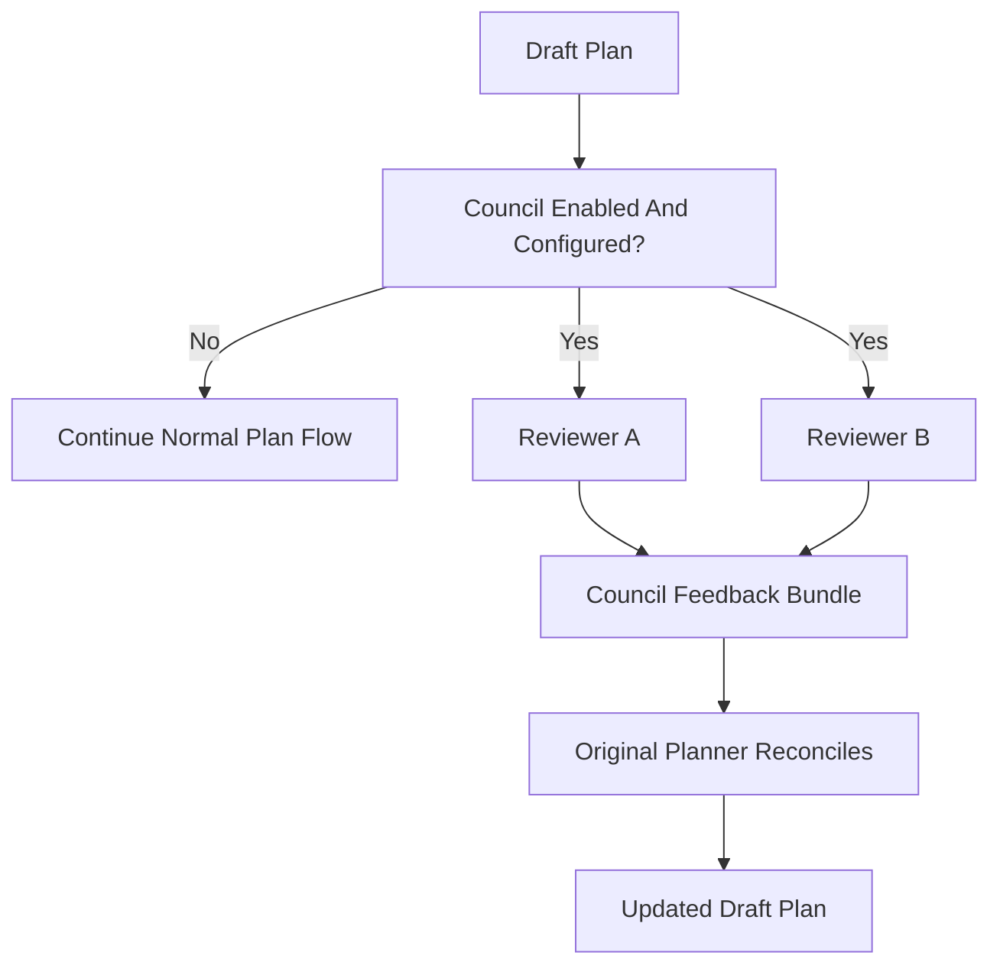

# contrejour

Narrative simulator and authoring desk for UNSEEN: a text-only playable, a Console, and rehearsal bots.

Scaffolded with [`create-spec-kit`](https://github.com/JobstVonHeintze/speckit-darkfactory-setup).
The scaffold follows the Anthropic Masterclass at Google Cloud Convention 2026
guidance: keep the harness light enough for agent freedom, verify outcomes at
the edges, and use evals to measure harness changes.

## Quick start

```bash
# Open the project in your AI editor (Cursor / Claude Code / Codex).
# The agents under .claude/agents/ are loaded automatically.
```

Read these files in order:

1. **`MANUAL.md`** — full user manual. Start here for concepts.
2. `CLAUDE.md` — the living contract for agents.
3. `specs/constitution.md` — project principles and module boundaries.
4. `DESIGN.md` — visual identity tokens and rationale.

You skipped the starter `BOOTSTRAP.md`. The scaffold is ready to use as-is;
run the bootstrap skill later if you want AI-assisted product calibration.

## First feature

```
/speckit.constitution     # refine principles (one time)
/speckit.specify "..."    # describe the feature in plain language
/speckit.plan             # generate a technical plan
/speckit.tasks            # decompose into ordered tasks
/speckit.implement        # build
```

## Agent evals

This project includes a private eval suite under `evals/`. Run it before
changing `CLAUDE.md`, agent prompts, gates, or models:

```bash
node evals/run.mjs --tier smoke
```

See `evals/README.md` for task format, hidden graders, trajectory metrics,
failure-mode tags, the held-out set, and the disabled-by-default private
benchmark under `evals/benchmark/`.

## Model council

This project includes optional multi-model draft-plan review under `council/`.
It is inspired by [Perplexity Model Council](https://www.perplexity.ai/hub/blog/introducing-model-council)
and adapted for software plans: configured headless reviewers critique a draft
plan, then the original planner reconciles `council-summary.md`.



It is disabled by default and stores no API keys. See `council/README.md`.

## Design system

The visual identity is defined in `DESIGN.md` using the
[`DESIGN.md`](https://github.com/google-labs-code/design.md) format.

```bash
npm run design:lint                           # locked local validator
npm run design:export                         # project-owned export wrapper
```

Ask `@frontend-designer` for UI work. It will read `DESIGN.md` first.

## Project layout

```
contrejour/
  CLAUDE.md                              the agent contract
  MANUAL.md                              full user manual
  DESIGN.md                              visual identity tokens
  specs/
    constitution.md                      principles + module boundaries
    _module-template/spec.md             copy for each new module
  docs/
    plans/                               plans stay here from draft -> done
    reviews/                             audits and sprint reviews
    manuals/                             end-user manual
    templates/
      plan-template.md
  .claude/
    settings.json                         Claude Code deny-list for noisy/sensitive paths
    agents/                              specialized subagents
    commands/                            slash commands (`/speckit-help`, `/correct-course`, ...)
  evals/                                 private agent eval suite
    benchmark/                           disabled-by-default background benchmark

  council/                               optional model council plan review

  .github/workflows/                     CI gates
  hooks/                                 pre-commit scripts
```

## License

Choose and add your license here.
