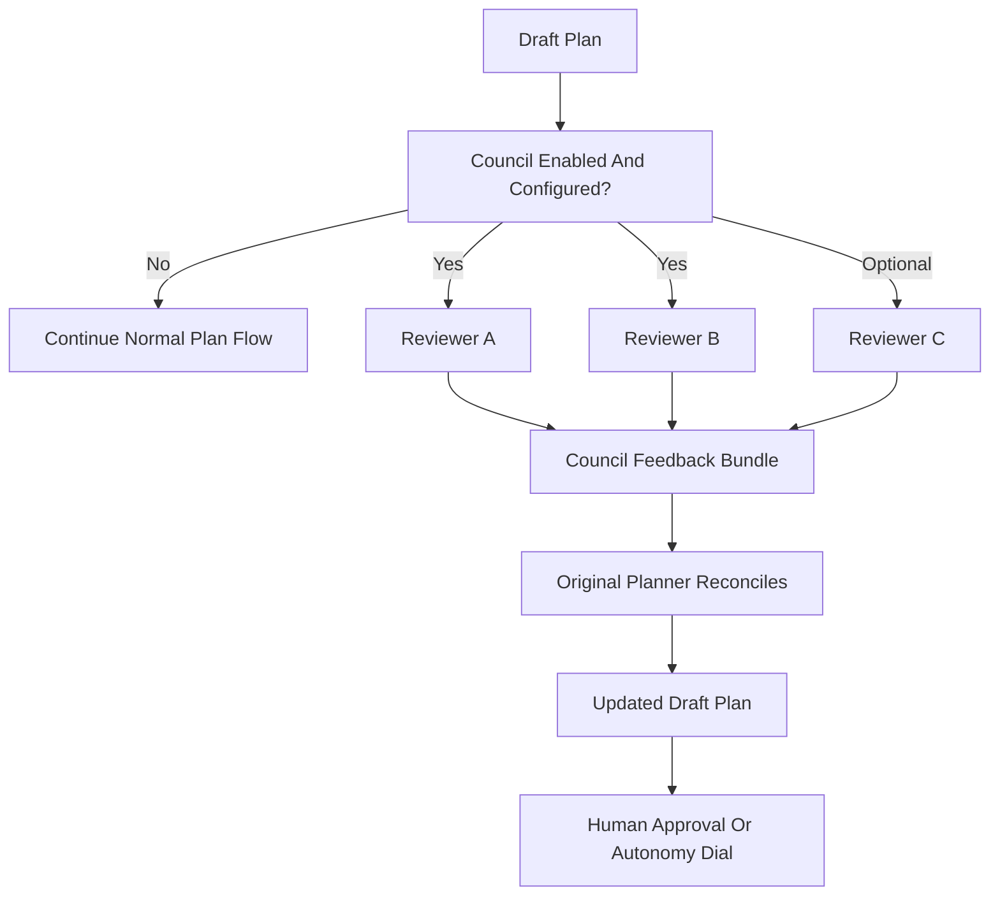

# Model council — contrejour

The model council is an optional plan-quality amplifier. It mirrors the manual
workflow where one model drafts a plan, independent models critique it, and the
original planner reconciles reasonable feedback before human approval.

## Sources of inspiration

- [Perplexity Model Council](https://www.perplexity.ai/hub/blog/introducing-model-council) — runs one query across multiple frontier models, then synthesizes agreement, disagreement, and unique contributions.
- Anthropic Masterclass at Google Cloud Convention 2026 — keep always-loaded markdown slim; use progressive disclosure via focused chapter docs; preserve agent freedom while verifying outcomes.
- [Agents' Last Exam](https://github.com/rdi-berkeley/agents-last-exam) — long-horizon agent evaluation pattern: task-only input, isolated work, hidden references, and trajectory capture.

This implementation borrows the multi-model critique/synthesis idea from
Perplexity, but applies it to software plans in a local/headless CLI workflow.
It is advisory, skip-safe, and stores no provider keys in the repository.

## Flow



## Local Claude Code reality

In Claude Code, a slash command is prompt expansion. If `/plan` or
`/model-council` asks Claude to run:

```bash
node council/run-council.mjs docs/plans/<plan>.md
```

that command runs in the foreground and the session waits until it returns.
This is not true background execution. Parallel reviewer commands and
`timeoutSeconds` keep it bounded, but expect the planning turn to pause.

The runner may spawn nested model CLIs. Each reviewer command must be
headless/non-interactive and write the review to stdout. Interactive model
commands can hang waiting for a terminal.

## Credentials

Do not put secrets in `council.config.json`. Store only model labels, command
templates, and required environment variable names there.

Use one of these:

- shell environment variables such as `ANTHROPIC_API_KEY`, `OPENAI_API_KEY`, or
  `GOOGLE_API_KEY`;
- provider CLI login state, if the CLI supports headless execution from the
  current shell;
- CI secrets if you later build a dedicated workflow.

If credentials or configured reviewers are missing, the runner exits 0 and
writes a skipped `council-summary.md`. Planning continues normally.

## Reviewer contract

Reviewers are write-free:

1. `run-council.mjs` reads the plan and rubric.
2. The runner sends the plan text and rubric to each reviewer command.
3. Reviewers write their critique to stdout only.
4. The runner writes all artifacts.
5. The original planner reads `council-summary.md` and decides what to adopt.

Raw model outputs go to:

```text
docs/reviews/council/YYYY-MM-DD-<plan-slug>/raw/
```

The durable summary goes to:

```text
docs/reviews/council/YYYY-MM-DD-<plan-slug>/council-summary.md
```

Only the `raw/` directory is gitignored and denied to agents. The summary is
intentionally readable so the planner can reconcile it.

## Reconciliation routing (escalate only taste)

Borrowed from gstack's `/autoplan` (auto-resolve the mechanical, surface only
the taste decisions). When the planner reconciles `council-summary.md`:

- **Auto-adopt** concrete, evidence-backed fixes the reviewers agree on (a
  missing test, an unhandled error path, a named risk). These do not need a
  human round-trip.
- **Escalate only genuine judgment calls** — scope, product trade-offs,
  irreversible or costly choices — to the human.
- Tie the escalation threshold to the `CLAUDE.md` autonomy dial: at
  `checkpointed`, surface every adopted change for approval; at `trusted`,
  surface only the taste decisions; at `autonomous`, log adopted changes and
  escalate only blockers.

This is a routing refinement, **not** a mandate to run more reviews — "freedom
inside, gates at the edges" still holds. Do not adopt gstack's review-on-
everything volume.

### Forcing function: describe the 10, then close the gap

Also borrowed from gstack's per-persona reviews. For each weak dimension a
reviewer flags, it should **state what a 10/10 version would look like**, then
propose the concrete edit that moves the plan toward it — not just assign a low
score. "Scope is a 6" is noise; "Scope is a 6; a 10 names the non-goals and the
rollback path — add both" is actionable. This pairs with the harness
`EVALUATION_RUBRIC.md` 0/1/2 scoring: the score says *where you are*, the "what
a 10 looks like" says *where to go*.

## Capability-map review

If the project has a `docs/capability-map.md`, the council should read it as part
of its context and check the plan against it: are the high-risk capabilities'
verification implications actually addressed? A plan for `agentic-ui` that omits
preview-before-write, a `multi-tenant` plan with no isolation test, or a
`money-movement` plan without idempotency are exactly the gaps independent
reviewers should catch. The capability map is a concrete object to critique, not
just prose — point reviewers at it alongside the plan.

## Relationship to evals and benchmarks

Council feedback should feed the measurement loop:

- If the council repeatedly catches the same planning weakness, turn it into an
  eval with `/eval-harvest`.
- Private benchmark packs should include planning tasks as well as coding tasks
  when planning quality matters.
- Council summaries are evidence for changing `CLAUDE.md`, `/plan`,
  `@sprint-runner`, autonomy level, or benchmark task selection.

This keeps the council from becoming another ritual: repeated findings become
measurable regression tasks.
