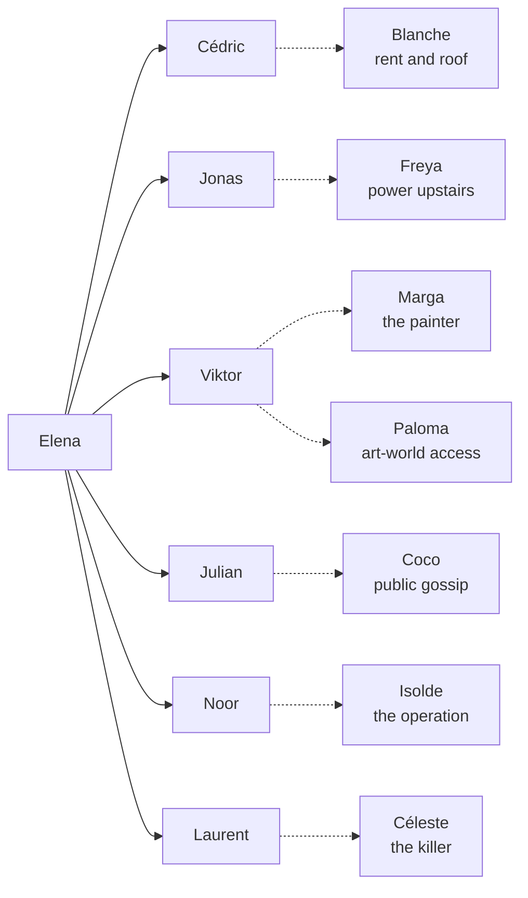
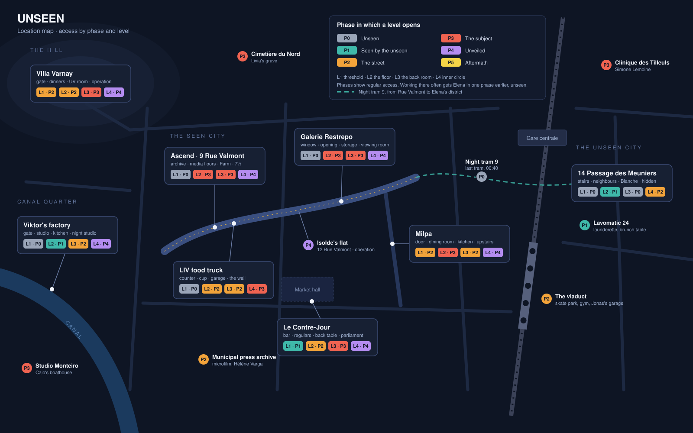

# UNSEEN — Story Bible (working title)

Exported from the living story bible on 2026-09-19 (second export, with Intimacy design). This file is narrative reference. Once imported, `canon/` is the source of truth.

## Premise and solution in brief

Elena Marin is not a ghost. She is a young woman nobody bothers to see, and someone has decided to keep it that way until she can vanish without a trace.

The film is built on false bottoms. It lets the player believe that Elena is dead, then that she is the girl who died ten years ago, and it commits to both before it breaks them. Later it offers a false victory and two false culprits. The full sequence is the reveal ladder in the plot map.

**The theme in one line:** nobody in this story is killed by violence. People are destroyed by not being seen, and the only ones who see everything are the people nobody looks at.

**The five layers, in the order the player uncovers them:**

1. *I am invisible.* Doors, colleagues and strangers ignore Elena. The player suspects a ghost story.
2. *He can see me.* The artist Viktor Rehberg sees her, and so does the grey woman in his house. Hope, and the start of a dark romance.
3. *I am not dead. I am scheduled.* An unknown muse who disappears triples the price of her portrait. Ascend has done this once before.
4. *The paintings talk.* At the vernissage a child smears wet cobalt paint. Underneath is handwriting: ten years of laundering, written into the canvases the criminals bought themselves.
5. *The girl from the cellar.* The killer of ten years ago is the person who once did Elena's job. She did not push anyone. She simply did not see a dying girl.

**Working title:** UNSEEN. Alternatives: *Blue Hour*, *The Girl in Green*.

**Setting:** an unnamed European city with a luxury shopping street, Rue Valmont. The Ascend building, Galerie Restrepo and the food truck all sit within two hundred metres of each other.

## The truth about Ascend

Ascend sells arbitrary value. Its real product is not reach but clean invoices, and it runs two laundering machines that mirror each other.

**Machine one: fame.** Shell brands that exist only on paper pay Ascend huge fees for influencer campaigns. The followers are bought, the engagement is faked, and nobody can prove what a post is worth. Dirty money goes in as a marketing budget and comes out as agency revenue.

**Machine two: art.** The same clients buy Viktor Rehberg's paintings through an advisor, at prices Laurent Vasseur sets. Galerie Restrepo issues the invoices. A painting is worth what someone pays for it, exactly like a post.

**The top floor.** The vault is upstairs, not in the cellar. The paintings are stored on Ascend's top floor as collateral, and deals are closed there after hours. The small gold key pendants open that floor. Whoever wears one is inside the business.

**Why the archive matters.** Every fake campaign had to exist physically once, as proof of performance for auditors: a printed ad, a lookbook, a magazine. One copy of each went to the cellar. Sorted by date, ten years of these publications form a complete ledger. Each shell brand appears for exactly one issue, always in the same week as a gallery sale.

**Why Elena has the job.** Hubert Lemoine, the accountant, has signed every one of those invoices. He cannot go to the police, so he created an off-the-books job and hired a nobody to sort the archive chronologically. Elena is assembling the case file without knowing it.

**Why the door does not open.** Hubert paid Elena through a suspense account. She has no HR record, and her badge is a visitor card. After 20:00 the glass doors only open for registered staff. The building does not know she exists.

## Ten years ago: Livia

Livia Hartmann died at the bottom of the Ascend cellar stairs at 25. Everything in the present is an echo of that night.

**Who she was.** Livia was Ascend's first face, the girl the agency was built on. She was Viktor Rehberg's model and lover, and the subject of the only portrait he ever painted of a person: *Livia in Green*. Laurent Vasseur loved her too. She never loved him back.

**What she found.** Livia worked out that her campaigns were for brands that did not exist. On the night of a gallery opening she told Viktor she was going to the police and leaving him. They fought on the cellar stairs. He was drunk. She fell.

**What Viktor believes.** Viktor ran. He has believed for ten years that he killed her. He has not painted since.

**What really happened.** Livia survived the fall. She lay at the bottom of the stairs, conscious, calling for help. The only person in the cellar was the archive assistant, a mousy 27-year-old called Sylvie Marchal, whom nobody upstairs had ever noticed. Sylvie looked at Livia, closed the archive door and went upstairs to tell Laurent there had been an accident. By morning Livia was dead.

**What came of it.** Sylvie became Céleste. She took Livia's place at Laurent's side and has held him ever since with what she knows. *Livia in Green* tripled in value within a year. Everyone involved learned the same lesson: a dead muse is worth more than a living one.

**Who never let go.** Livia's mother Marga entered Viktor's house as a housekeeper under her maiden name, to find out what happened. Livia's brother Jonas parks a food truck outside the building where she died. Isolde Varnay, who had recognised a future supermodel in Livia, has spent ten years and a fortune buying every Rehberg she can, because she suspects what is in them.

## Plot map

UNSEEN is an interactive film in four parts. A fixed spine of gate scenes carries the mystery, and between the gates the player roams freely. The story is built to mislead boldly, several times, and to let the player push Elena in any direction without losing the thread.

### How the story moves

- **Gates and evenings.** Each part has a handful of gate scenes that every player sees. Between them, time passes in evenings: free blocks in which the player decides where Elena goes and whom she approaches.
- **Two triggers per gate.** A gate fires when the player has found enough, or when its date arrives, whichever comes first. Slow explorers are not punished, fast ones are not held back, and nobody gets lost.
- **A clock everyone can see.** From Part I on, posters for Viktor Rehberg's exhibition *UNSEEN* hang across the city, with a date and a covered canvas. Smaller rhythms run under it: rent on the 1st, the Sunday call, Thursday soup, Laurent at the grave on the 14th.
- **Every side strand bends back.** A flirt, a date or a shift at Milpa always ends on a hook: a clue, a door or an enemy. A player who only chases romance still collects the case, by accident.
- **The story finds her.** If the player has not found Livia by a certain date, Livia finds Elena: a letter for L. Hartmann, Blanche's slip of the tongue, a remark from the tram driver.
- **The phone keeps the thread.** The Notes app always shows one line at the top: the current open question.

### Pushing the limits is content

Elena can flirt with anyone, at any time, from the first evening. Nothing is locked. What changes is the response.

In Part I most attempts fail in the same eerie way: Laurent looks straight through her, Julian answers someone behind her, Bastien at Milpa holds the door for the couple she walked in with. Those failures are the strongest evidence for the ghost theory, and the player produces them personally. The same attempt plays differently in every later part, which rewards both persistence and replay.

### The theory question

Three times, someone asks Elena point-blank what she thinks is happening to her: Dalia on the stairs in Part I, Isolde at dinner in Part II, Céleste in the lift in Part III. The player picks an answer: *I think I died. They are doing it on purpose. I am losing my mind. It is just this city.*

The film records the answer and plays to it. The next scenes first seem to confirm the chosen theory, then break it. Two players with different theories see different evidence on the way to the same gate.

### The reveal ladder

Nine beliefs, five of them false. The film commits fully to each false one before it breaks it, and the player's own pace decides how long each one lasts.

| # | Part | The player believes | What feeds it | What breaks it |
| --- | --- | --- | --- | --- |
| 1 | I | **She is dead and does not know it.** | The door, the lobby, the food truck, the accountant, the tourists. Every flirt the player attempts. Posts with zero views. Her mother not picking up. | Nothing yet. See stage 2. |
| 2 | I | **She is the girl who died here. She is Livia.** | Post for L. Hartmann. A green dress in her size. The cat that knows her corner of the bed. Blanche calling her Livia. Pencil marks that stop ten years ago. The archive covers exactly the decade she is "missing". | Dalia's fingers on her wrist: seventy-two. Her mother's phone was broken. Pia's message. A press photo of Livia, who has a different face. |
| 3 | I to II | **She is alive. So why is she invisible to some?** Class? A curse? Her own mind? | The basement sees her and the media floors do not. Strangers vary. Ous greets her, Laurent never has. | Hugo's "suppress" list, Pavel's badge record, Solène's letter. It is administrative. She does not exist on paper. |
| 4 | II | **Someone ordered it, to protect the firm from an unregistered hire.** | Céleste's login on the list. The cancelled event. Julian's sudden charm. | The overheard sentence: "Nobody has seen her. Keep it that way until the opening." |
| 5 | II | **She is scheduled.** An unknown muse who vanishes triples the price of her portrait. | Livia's price history. Her own missing paper trail. | The vernissage. After Tobi's stream she is the most watched girl in the city. Nobody can make her quietly disappear. |
| 6 | II to III | **They are finished. She won.** | The ledger read aloud, the room in uproar, Marga stepping forward. | The next morning. Laurent calls it all an artwork about money, sacrifices two partners, and offers Elena a contract. |
| 7 | III | **Viktor killed Livia.** | His own confession. Marga's ten-year certainty. The fight on the stairs was real. | Kurt: "You were too drunk to push a door." Then Rosa: the body was cold and the stair door was locked from the lobby side. Livia survived the fall. |
| 8 | III | **Laurent locked the door.** | He loved her and she refused him. The scar. The monthly visits to her grave. He is the obvious villain. | He punched the mirror because he found out afterwards. The old staff list: archive assistant, S. Marchal. White roses at dawn. |
| 9 | III to IV | **Céleste. The last invisible girl.** | Everything, in hindsight. | It is true. |

### Who can see a ghost

The early cast is chosen so that the ghost theory survives contact with it. In ghost stories the dead are seen by the old, by children, by animals, by eccentrics, by the grieving and by artists. The first people who see Elena are exactly those: Blanche, whose memory slips. Inaya, whose mother calls Elena an imaginary friend. Mardi the cat. Two retired magicians. A recluse who never leaves his flat. A tram driver at midnight. A haunted painter and a mother in mourning.

Cédric fits too. In the ghost reading he is a lonely man courting a girl only he and his mother can see.

Ordinary witnesses are the counter-evidence: Dalia, Bernadette, Pavel, Ous. The player meets them by choosing to go where they are. A player who tests the theory hard breaks it early. A player who drifts keeps it until Dalia's pulse check, the last gate of Part I.

### Part I: Unseen (phases 0 and 1)

**The question:** am I dead? The first night mixes coincidence with intent, so that Elena and the player generalise wrongly.

| What Elena experiences | What is really happening |
| --- | --- |
| The meet-the-media-team event is cancelled by email ten minutes before it starts. | Céleste checks every list. She found "E. Marin, Archive" and froze: nobody has worked in the archive for ten years. She cancelled the event to keep the cellar girl out of sight. |
| Laurent and Céleste come down, joking too intimately. They do not notice her. | Laurent truly does not see her. He has never looked at basement staff in his life. Céleste sees her perfectly and chooses not to. |
| Noor, the concierge, turns away to her phone when Elena asks a question. | Noor is calling Dragan, the second guard, so that someone opens the door for Elena. She cannot acknowledge her in front of Céleste. |
| The glass door does not open. Dragan comes in on the phone and she slips out. | Her visitor badge is dead after 20:00. Dragan was sent. He saw her and said nothing, as instructed. |
| Among the waiting limousines stands an aubergine car with a chauffeur at attention. As Elena passes, the rear window lowers by five centimetres. Violet glasses, nothing else. | Isolde Varnay. Noor reported an unregistered girl in the archive on Elena's second day. Isolde is the one person on Rue Valmont who looks at Elena that night, and she is deciding what the girl might be good for. |
| Jonas at the food truck flirts straight through her at Freya. | Pure coincidence. He really did not notice her. That will bother him later. |
| A businessman nearly crashes into her and walks past. | Hubert saw her very well. He hired her, he knows what he has put her into, and he cannot look her in the face. |
| Ous takes the Korean couple's phone before she can. | Coincidence, and kindness. Min-jun's camera has Elena in the background of three photos from that night: proof that she exists. |
| The gallery door is stuck, then someone seems to open it. | Marga opened it. She saw a soaked girl in a green silk blouse through the glass and, for one second, saw her daughter. |
| The artist sees her and talks to her. | Viktor is the one man in the city haunted by a girl in green. He would have seen her through a wall. |

**Gate scenes**

1. **The first night.** As in the table above: the lobby, the door, the aubergine car, the truck, the accountant, the tourists, the rain.
2. **The gallery.** Marga opens the door. Viktor sees a wet girl in green and asks her to be the subject of his next work.
3. **The roof room.** Her first morning in the flat. A letter for L. Hartmann on the mat. A grey cat asleep on her bed. Downstairs, the landlady says: "You're up early, Livia."
4. **The first sitting.** In secret, at the factory. He draws for hours and never touches a canvas. A silent woman in grey brings coffee and looks at Elena for a long time.
5. **The woman in white.** A few evenings later, at the gallery. A very tall old woman in ivory sweeps past with two assistants in violet and a trembling whippet. She stops, looks Elena up and down and says: "You are not looked at, my dear. That is either a tragedy or a weapon." Then she is gone.
6. **The wardrobe.** The green dress in her size. The pencil marks that stop ten years ago. Her mother's phone rings out.
7. **The pulse.** At 6 a.m. on the stairs, Dalia asks the theory question and takes her wrist. The same day, Bernadette turns her screen around: "Chérie, according to this machine you do not exist." Alive, and yet not there.

**Free to explore.** The house and its liminal neighbours. The archive, where sorting is a quiet game of its own. The night tram and Lavomatic 24. The basement colleagues, for players who look. Experiments on the theory: shouting in the lobby, knocking over a glass, posting online. Flirts that go straight through people. Lunch with Cédric. The first audio drops, banking secrets 1, 2 and 17.

**The pull.** Rent falls due on the 1st and forces a scene with Blanche and Cédric. Viktor's messages. The first *UNSEEN* posters go up.

**Ends on:** I am alive. So why can they not see me?

### Part II: The Subject (phases 2 and 3)

**The question:** who decided that I do not exist, and what happened to the girl before me?

**Gate scenes**

1. **The street opens.** Ous greets her and apologises for grabbing that phone. Jonas realises he looked through her. Her name goes on a cup.
2. **Thursday at eight.** A card arrives at the roof room by hand, ivory with an aubergine edge: "Thursday. Eight. Wear the green." Elena never gave anyone her address. Harriet's car waits in Passage des Meuniers, and the whole house watches from its windows. The dinner at Villa Varnay is a test in four courses. See the Isolde section.
3. **The pattern.** Sorting reaches the year Ascend was founded. Brands that exist for one issue only, always in the week of a gallery sale. And on every early cover, a girl in green. Hubert's pencil ticks have been pointing at them all along.
4. **The order.** Hugo's "suppress" list, Pavel's badge record and Solène's letter, in any order. Her invisibility is a decision, entered from Céleste's login on Elena's second day.
5. **The visitor in the archive.** Late at night Céleste comes down alone, walks the aisles in the dark and rests her fingers on "S.M. was here". Elena watches from between the shelves. See Deepened characters.
6. **The sittings become known.** Phase 3 begins. Julian suddenly finds her fascinating, Paloma's warmth cools by a few degrees, and Isolde sends a second card. If Elena passed the first dinner, this one opens the Rehberg room.
7. **The floorboard.** Livia's notebook. The last page: "Told V. tonight. If something happens, ask the mouse in the archive. She hears everything."
8. **The sentence.** An audio drop in the lift catches Laurent and Céleste: "Nobody has seen her. Keep it that way until the opening. Livia tripled in a year."
9. **One room.** Marga and Isolde have not spoken in ten years and have run two parallel revenges. Elena is what puts them at one table, in Isolde's flat across the street from Ascend. On the light path she consents to stay in place as bait. On the dark path she sells her silence upstairs, and this scene never happens.
10. **The vernissage.** The set piece with the whole cast. Casimir's finger, Rui's gloves, Judith reading the ledger aloud, Tobi's stream, the unveiling, Defne's accusation, Marga stepping forward as the painter.

**Free to explore.** The dating matrix for phases 2 and 3. Shifts at Milpa and the chef's table. Le Contre-Jour and the viaduct. Isolde's dinners. The brunch table. Most of the secrets catalogue is banked here, while Elena can still stand anywhere unnoticed.

**The pull.** The exhibition date on every poster. Céleste's canary. Régis Poulain's monthly visits, each with a higher offer and a shorter temper.

**Ends on a false victory.** The room is in uproar, the conspirators flee, and Elena's follower count passes six figures within the hour. The player believes it is over.

### Part III: Unveiled (phase 4)

**The question:** now that everyone sees me, what do they see?

**The morning after.** Laurent holds a press conference. *UNSEEN*, he says, was a collaboration between Ascend and Viktor Rehberg: an artwork about money and visibility, and the ledger is fiction. Meredith Crane has left the country. Paloma is arrested and the gallery is sealed. Dr. Frick dissolves six shell companies overnight. Rehberg prices double.

The plan to make Elena vanish is dead, because a girl the whole city watched on a livestream cannot disappear quietly. Céleste changes strategy from erasing her to absorbing her. Ascend offers Elena a contract as its new face, a desk upstairs and Freya's place.

**Gate scenes**

1. **The spin.** The press conference, watched on a phone in the basement with Bernadette.
2. **The contract.** Elena signs. The scene is identical on both paths and the intent is not: she goes in as the inside witness for Isolde and the prosecutor, or she goes in for herself.
3. **The first campaign.** Her face, a brand that does not exist, a fee that makes no sense. She is now inside the fame machine, and a copy of the campaign goes down to the archive she used to sort.
4. **The scan.** A clause in the contract asks for a full scan of her face and body "for campaign flexibility". Mila Noir's first face was Livia's. Her next one is meant to be Elena's.
5. **Floor 7½.** The walnut drawer for phones, the second phone in her boot, *Livia in Green* on the wall. At the head of the table sits someone Laurent is afraid of: the Client.
6. **Week seven.** Fame curdles, as Coco said it would. The old TV clip resurfaces. Someone from home arrives in the city, knowing about the clip and the lie.
7. **The confession.** Viktor tells her he killed Livia. Marga, asked, says only: "I have known for ten years."
8. **The locked door.** Kurt's certainty, Rosa's statement, Teyssier's file. Livia survived the fall. Someone locked the stair door from the lobby side. For a while, everything points to Laurent.
9. **The wrong man.** Someone has to tell Marga. She has punished Viktor for ten years, and the person who let her daughter die was buying her paintings.

**Free to explore.** Phase-4 dating, including Laurent, Laurent and Céleste together, Coco and Rupert. The upstairs room at Milpa. Caio's studio on the canal. The visiting room where Paloma is held. Leverage or exposure, secret by secret. The dark doors: Régis and Blanche's signature, Loïc's services, Meredith's number. The brunch table, holding or emptying. And one absence the film never announces: Ous is no longer at the viaduct.

**The pull.** On the light path, the prosecutor's deadline: Dr. Frick is dissolving shells one by one, and a counter shows how many are left to seize. On the dark path, the date of Ascend's next board meeting.

**Ends on:** the old staff list. Archive assistant: S. Marchal. And at dawn in the Cimetière du Nord, a woman without her hair done, laying white roses.

### Part IV: The Stairs (phase 5)

**The question:** what will I do with what I know? This part is short and convergent. Exploration narrows to last conversations.

**Gate scenes**

1. **Dawn at the grave.** Elena photographs Céleste as Sylvie. It is the only time anyone sees her.
2. **The recipient.** The player opens Messages and chooses where secret 22 goes: to Teyssier, Noor and the prosecutor, to Céleste herself, or nowhere yet. This choice sets who is waiting upstairs in the last scene.
3. **The anniversary.** The night Livia died, ten years and some months on. On the light path Céleste takes Elena's arm and says: "I can explain everything. Come." On the dark path it is Elena who asks Céleste to come down to the archive.
4. **The confession.** On the cellar stairs, with something like relief:

> "I never pushed anyone. I just did not see her. It is the easiest thing in the world. They did it to me for three years."

5. **The key.** Céleste unclasps her gold key and offers it. One of them always comes up from the cellar, she says.

**Last conversations.** Before the anniversary the player can visit everyone who is still speaking to Elena. The number of people who know where she is going that night is the number who come looking. Nobody rescues her. Whoever arrives, arrives after she has already answered.

**The ending** follows the four-endings grid under *The moral system*. On the light path the glass door opens for Elena for the first time, because Noor registered her badge that afternoon.

**Final image, one year later.** Rain. A young woman pulls at a door that will not open. Elena, known and busy and on the phone, brushes past her. On two of the four endings she stops three steps later, turns around and says: "Hey. Do you need help?" On the other two she does not.

**After the title.** A letter from Vaduz lies on Blanche Oury's doormat. The offer for the house has doubled. It is signed, for the first time, with a name.

### The decision spine

Hundreds of small choices shade the run. These twelve commit it. Each one is a scene, and each locks something for good.

| # | Part | The decision | Light | Dark | What it locks |
| --- | --- | --- | --- | --- | --- |
| 1 | I | Cédric's lunch | Go, be kind, be clear. | Let him believe he is her crush. | The terms on which he later hands over the master key. |
| 2 | II | Hubert's testimony | Visit Simone and carry her message. | Threaten him with his wife's care costs. | Bernadette's seat at the table. |
| 3 | II | Jonas, while he is still seeing Freya | Wait. | Take him. | Freya as friend or as enemy. It matters most in Part III, when Elena takes her place. |
| 4 | II | Julian | Feed him nothing, or turn the canary around. | Confide in him, or make him a double agent. | How thick Céleste's file on Elena becomes. |
| 5 | II | Noor's secret | Keep it. | Sell it to Céleste for a key. | The point of no return for the dark path. The operation collapses and the parliament never meets. |
| 6 | II | Marga's one question | The truth. | A lie, or a break-in. | The night studio, and how much of the ledger is legible at the vernissage. |
| 7 | II | "Keep it that way until the opening" | Take the recording to Noor and Isolde, and consent to be bait. | Sell her silence to Laurent. | Whether gate 9, the one room, happens at all. |
| 8 | III | The contract | Sign as the inside witness. | Sign for herself. | Who she reports to for the rest of the film. |
| 9 | III | The first signature on floor 7½ | Refuse, and find another way to record the room. | Sign, and receive a gold key. | She is now blackmailable for a real crime. |
| 10 | III | Viktor's confession | Bring him Kurt and the file, and free him. | Keep it, and keep him. | Whether Viktor's route is a love story or a hostage situation. |
| 11 | IV | The recipient of secret 22 | Teyssier, Noor and the prosecutor. | Céleste herself. | Who is upstairs on the last night. |
| 12 | IV | The key | Refuse it. | Take it. | The ending. |

### Ending gates

| Ending | What it requires |
| --- | --- |
| **The truth comes out** | Three documents from this list: the archive pattern, Hubert's books, Paloma's second set, Marisol's remittance slips, Jonas's log, Teyssier's file. Two witnesses willing to speak, from Hubert, Rosa, Cédric, Marga, Paloma and Defne. One channel that is believed: Judith, Ji-woo or the prosecutor. |
| **Elena still sees people** | At least two seats at the brunch table still taken. No given secret ever used as leverage. Decision 5 kept. |
| **Ascend** (truth buried, Elena unseeing) | The archive pattern. Secret 22. A gold key, which means a signature. Dr. Frick's cooperation, bought or forced. Laurent's trust or Laurent's fear. |
| **The empty table** | The truth gate is met and the seeing gate is not. |
| **The third girl in green** | Neither the truth gate nor the takeover. She stayed decent and did not gather enough. |

The player is never shown these lists. After the vernissage, the phone's Notes app quietly starts counting: documents, people who will speak, people who would come looking.

### Characters this structure needs

| Character | Who | Why the story needs them |
| --- | --- | --- |
| Odile Ferrand, 48 | Financial-crimes prosecutor. Noor's former superior, who let her be pushed out and has regretted it since. | Someone with the power to arrest has to exist in the present. She is cautious, overworked and only moves on paper, which is why recordings do not impress her and the archive does. |
| The Client | The beneficiary of the trust in Vaduz. First seen at the head of the table on floor 7½ in Part III. | The antagonist above Laurent, and the engine for anything after this story. Identity open. The shock option is someone the player already trusts, such as Beat Amstutz. The safe option is a new face. |
| Grégoire Tellier, 45 | Head of media at Ascend. On paper, Elena's line manager. | He signed off a headcount he never looked at and has not once been down to the cellar. The most ordinary kind of not seeing, and the reason "meet the media team" existed at all. |
| Nico Brandl, 26 | Elena's ex from home. One of her eleven followers. | The visitor in Part III, week seven. He knows about the clip and about the lie. He is either a threat, a temptation to go home, or the one person who liked her before anyone looked. |
| Mateo and Sofia Marin | Elena's older brother and younger sister. | Voices on the Sunday calls. Sofia now sleeps in Elena's old room. |

**Still to write up properly:** Elena herself. She has no character sheet yet, and no defined voice. Proposal: a dry, observant narrator's voice, the humour of someone who has spent her life watching from the edge. Her skill is pattern recognition, which is why she is the one who sees the archive's rhythm. Her flaw is already in the back story: she lied to everyone at home, easily, which is the seed of the dark path.

## Relationship map

Almost every couple in this story is something other than it appears. The rule: the louder the flirtation, the less there is behind it.

| Pair | What it looks like | The truth |
| --- | --- | --- |
| Laurent and Céleste | CEO and assistant, obviously lovers. | They slept together once, nine years ago. He has never loved anyone but Livia. She has loved him since her cellar days and now owns him through what she knows. It is a hostage situation in couture. |
| Laurent, Céleste and Noor | A flirtatious after-hours triangle. | Cover. Noor is Isolde's plant inside Ascend and plays whatever role keeps her gold key. The person she is actually drawn to is Elena, whom she has been quietly protecting since the first night. |
| Viktor and Marga | Wife? Housemaid? | Neither. She is the mother of the girl he believes he killed, and he half knows it. She paints, he signs. They have never touched. It is a ten-year marriage of penance. |
| Viktor and Paloma | Artist and gallerist. | Lovers twenty years ago. She still loves him. She built the price machine to keep him afloat when he stopped painting, and told herself it was for art. |
| Viktor and Elena | The great man and his muse. | The dark romance route. He is in love with a colour, with being forgiven, with a second chance. Whether he ever sees Elena and not Livia is the question the player answers. |
| Jonas and Freya | The cute new couple of the street. | Two dates. Then Ascend signs Freya and she drifts upward. Jonas's real attachment is to his dead sister. His slow route with Elena begins when he realises he looked through her. |
| Isolde and Marga | Strangers at a vernissage. | They were the two faces of one campaign in 1979. Isolde has loved Marga for forty-five years. That is why she finances everything. |
| Cillian and Mika | Two eccentric assistants, neither apparently interested in the other's gender. | A devoted couple. Isolde took both in when they had nowhere to go. |
| Beat and Sandro | A collector and his amusing friend. | Sandro has loved Beat for thirty years. Beat knows. Neither has ever said it, and both are content. |
| Gerhard and Jasmin | Old money-maker and trophy wife. | She runs his company's books and is the smartest person in most rooms. She is bored because nobody ever asks her anything. |
| Thibault and Lucía | A first date. | It is also the last. She leaves with the gatecrashers. He is left holding two glasses. |
| Tilde and her future husband | Waitress hunting a millionaire. | She targets Laurent. Céleste, recognising herself at 22, dismantles her in one sentence. Tilde ends the night sharing fries with a broke sculptor and, to her horror, enjoying it. |
| Hubert and Simone | Unseen. | His wife knits his vests. Her care costs are the reason he signed the first false invoice. |

**Romance routes for Elena:** Viktor (dark, intoxicating, possibly a repetition), Jonas (warm, slow, guilt-laden) and Noor (dangerous, protective, the only one who saw her from the first minute). A fourth, false route (Julian Castel) and a solo route are described under Romance for Elena. Each route changes who arrives at the cellar stairs afterwards.

## Principals: Elena, Ascend, the street

Each entry names the character, gives the lore and explains the visual tells already built into the character sheets.

### Elena Marin, 24, the player character

Elena grew up in a small town, studied media in a city nobody has heard of and arrived here three weeks ago with two suitcases and 11 followers. She wants to be seen, professionally and otherwise, and has never quite managed it.

She took the Ascend job because the name alone would fix her CV. On the first night she wears a green silk blouse, a mini skirt, thigh-high stockings and over-knee boots for an event that was cancelled. Green is the only colour in the cast that belongs to nobody else. It belonged to Livia.

Her weakness is also her gift. People forget she is in the room, so they keep talking.

### Laurent Vasseur, 52, CEO of Ascend

Laurent founded Ascend twelve years ago with one real talent, Livia, and built the laundering machine when legitimate growth was too slow. He is vain, charming and lazy about details, which is why Céleste runs everything.

His second phone is for clients who have no names. The scar through his eyebrow is from the night Livia died: he punched a mirror. He does not see basement staff. It is not malice. They are simply not in his field of view.

### Céleste Marchal, 37, born Sylvie Marchal

Ten years ago she was the mousy archive assistant whom nobody greeted. She watched Livia have everything. After the night on the stairs she changed her name, her hair and her place in the building.

The blonde mane takes an hour every morning because she has sworn never to be overlooked again. The memorising gaze and the privacy-screen phone are the real Céleste. The cocktail-bar styling is armour. She recognised Elena's position on the staff list within a second, because it was hers.

### Noor Delvaux, 29, concierge

Noor is a former financial-crimes investigator who was pushed out of the police for refusing to drop a case. Isolde Varnay hired her two years ago and placed her at Ascend's front desk.

The gold watch was a gift from Laurent, and she wears it like a wire. The second cable under her collar is Isolde's line. Pinned inside her lapel, where only a very close observer would see it, is a small violet enamel pin. She has the gold key and hates every evening she has to use it.

### Dragan Petrović, 52, night guard

Dragan works for the security firm that covers both Ascend's night shift and Galerie Restrepo's events. He was a police officer in Belgrade for twenty years.

He noticed within a week that the concierge moves like a colleague. He has said nothing. When she tells him to come in through the front door at a certain minute, he comes.

### Jonas Hartmann, 27, food truck

Jonas was 17 when his sister died. He dropped out of a culinary school to be near his mother, bought a rusty step van and parked it where he could see the building's entrance.

The pencil behind his ear is not for orders. In a notebook under the counter he logs every limousine: plate, time, passengers. He has ten years of evenings. The truck is called LIV, hand-lettered on the side, and nobody has ever asked why.

### Freya Holm, 25, yoga teacher in training

Freya is exactly what she seems: kind, a little dreamy and unaware of what her face could earn. Laurent sees her through the lobby glass in week two and sees another Livia.

Ascend signs her within a month. She becomes what Elena wanted to be, and for a while Elena hates her for it. Freya is also the first person at Ascend who simply says hello. Her pass gets Elena onto the media floors, where she first notices a lift stop marked 7M that no button reaches. In the alternate ending where Elena fails, Freya is the next girl in green.

### Seo Min-jun, 36, and Han Ji-woo, 34, visitors from Seoul

They are on a delayed honeymoon. Min-jun is an architect who photographs every facade. Ji-woo is a financial journalist who promised not to work on this trip.

One of his blue-hour photos shows Loïc loading a wrapped painting into a limousine outside Ascend, with a girl in a green blouse in the background. Ji-woo recognises one of the shell brands from a story she once dropped. She breaks her promise.

### Ousmane "Ous" Diarra, 19, dancer

Ous trains at a boxing gym, dances in a crew and earns cash as a bicycle courier. Twice a week he carries sealed envelopes from Ascend to the gallery and has never wondered why an agency pays so well for that.

He is the first stranger who consistently sees Elena, and the living proof that she is not a ghost. He knows Yanis and Linh from the skate park, which is how the gatecrashers get into the opening.

### Hubert Lemoine, 54, head of accounts

Hubert has worked in the basement for nineteen years, first for the building's previous tenant, then for Ascend. He signed the first false invoice when his wife Simone fell ill and the clinic needed paying. After that there was no way back.

He remembers Livia's laugh in the corridor. He leaves at exactly 19:30 every evening because at 20:00 the building changes. The lanyard he forgets to take off is the one item that still says where he belongs. His worn briefcase holds a copy of the suspense account that pays Elena.

## The art world

Six people and a dog. Two of them are running the counter-conspiracy, and one of them does not know he is its instrument.

### Paloma Restrepo, 46, owner of Galerie Restrepo

Paloma came from Medellín at 22 to study art history and opened her gallery at 31 with one artist: Viktor Rehberg, her lover at the time. When he stopped painting after Livia's death, she faced bankruptcy.

Laurent offered a solution: guaranteed buyers at guaranteed prices. She told herself she was protecting an artist. She knows the sales are dirty. She does not know that Livia's death was anything but an accident, and she had no part in the plan for Elena.

The raw emerald on her collar was bought with her commission on *Livia in Green*. She has never been able to take it off or to enjoy it. When the paintings talk, she is the first insider to turn.

### Viktor Rehberg, 56, painter

Viktor and his friend Kurt bought their paratrooper boots in an army surplus shop in 1989 and swore to wear them until they were famous. Only one of them got there.

He has not painted a canvas in ten years. He draws constantly, in graphite, in the black notebook. The cobalt-and-white paintings that made him a superstar are Marga's. He signs them because he believes he owes a debt that cannot be paid, and because the woman in his house has never once said what she knows.

The cheap plastic watch was a gift from Livia, who bought a pack of two. He sees Elena because of the green blouse. Whether he ever learns to see her without it is the heart of his route.

### Marga Winter, 58, the woman in grey

Born Margarethe Winter, she was one of the great faces of the late 1970s, then walked away from modelling to paint and to raise two children under her husband's name, Hartmann. After Livia's death she applied as Viktor's housekeeper under her maiden name. He did not recognise her.

She came to find proof and found a broken man who believed himself a murderer. She stayed to punish him, then to watch the others. When he could not paint, she began to paint for him: white and cobalt, her daughter's colours, over graphite lines that record every dirty sale she overheard on his phone.

The ring on the chain is Livia's. The plastic watch is the other one from the pack of two. She stopped arranging herself for the world the day her daughter died. She is neither wife nor maid. She is his warden, and the author of every work in the exhibition.

### Isolde Varnay, 68, collector

Known in the 1970s by her first name alone, Isolde married twice, inherited twice and has spent the money on art and on people. She has loved Marga Winter since 1979 and was never loved back in the same way.

She was Livia's godmother in all but name and saw the supermodel in her at 16. For ten years she has bought every Rehberg that came to market, which also made her the conspiracy's best customer and above suspicion. She wears no gold. She owns the largest part of the evidence, hanging in her own house.

She never leans on the cane. It belonged to her first husband, and she uses it to point at things she intends to own.

### Cillian Byrne, 25, and Mika van Rijn, 22, her assistants

Cillian grew up in Cork, was thrown out at 17 and met Isolde while working the cloakroom at an auction. He handles her words: letters, bids, gossip, charm. He remembers every name in every room.

Mika was a junior fencing champion in Rotterdam until an injury ended it. She handles everything physical: the door, the car park, the aluminium case. The case holds a UV lamp, a camera and condition-report forms. She has photographed the underdrawing of every Rehberg Isolde owns.

They have been a couple for three years. Almost nobody notices, which amuses them.

### Brancusi, 4, whippet

Brancusi belongs to Isolde and tolerates Cillian. He trembles in the presence of exactly one person in the story, and it is not the obvious one. He is afraid of Céleste.

### Harriet Cole, 45, Isolde's chauffeur

A former army driver from Yorkshire. She has worked for Isolde for eleven years and has an arrangement with Jonas: he logs the limousines from the truck, she runs the plates.

## Isolde Varnay: presence, the test and the intervention

Isolde finances the counter-operation, employs Noor and owns most of the evidence. She is present from the first night, tests Elena early and is never simply on her side.

### Two addresses

**Villa Varnay, on the hill.** A white modernist house from the 1920s, severe and beautiful. There are no mirrors in it. Isolde was looked at for a living for twenty years and has had enough. The only photograph of her younger self stands on the piano: a campaign picture from 1979, two models, and the other one is Marga. Cillian and Mika live in the gatehouse, Harriet above the garage. The swimming pool was emptied long ago and is a sculpture court. The Rehberg room, permanently under UV lamps, is the old wine cellar.

**The flat at 12 Rue Valmont.** A top-floor apartment diagonally opposite Ascend, in the house where Gilbert Roche lives. The villa is ceremonial and the flat is operational. From its windows the band of light on floor 7½ is plainly visible. Noor's camera feed ends here, and so do copies of Jonas's limousine log and Mika's UV photographs. Gilbert has muttered about "the violet people upstairs" for two years. Nobody asked him what he meant.

### Three early appearances

| When | What the player sees | What it does |
| --- | --- | --- |
| Part I, the first night | The aubergine car outside Ascend. The rear window lowers by five centimetres. Violet glasses. | Someone is looking at Elena. The player cannot tell whether that is a comfort or a threat. |
| Part I, gate 5 | The woman in white at the gallery, with her line about tragedy and weapons. | In the ghost reading she is close to a figure of death: a tall old woman in white with a cane and a hound, who sees the girl nobody sees. |
| Part II, gate 2 | The card: "Thursday. Eight. Wear the green." | Delivered to a dead girl's flat, it pushes the "she is Livia" belief hard. At dinner Isolde helps break it: "For a second I thought... no. You look nothing like her. It is only the colour." |

**How they found her address.** Cillian belongs to an informal network of personal assistants to the rich, another unseen class that knows everything. It took him one afternoon.

### The first dinner: a test in four courses

Isolde lost one girl already. Before she risks another she needs to know what Elena is: another Livia, who was brave. Another Céleste, who will sell. Or nobody at all.

Mika collects Elena's phone at the door in the aluminium case. It is a house rule, and it means the player cannot simply record the evening.

| Course | The test | What happens | What Isolde learns |
| --- | --- | --- | --- |
| First | Being looked at | Isolde studies her in silence for a full minute. "Most people do something with their face when they are watched. You do not. Nobody ever taught you." | Whether Elena can bear to be seen at all. The player chooses: hold the gaze, look away, or look back just as hard. |
| Second | Temptation | Cillian leaves her alone with a loose Rehberg drawing worth a year's rent, an envelope of cash "for the taxi", and an unlocked phone on the table. | What she takes, what she reads, what she leaves. Mika is watching from the gallery above. |
| Third | Kindness | Wine is spilled on the green blouse, not by accident. Harriet, the cook and the whippet all pass through the room. | How Elena treats people who serve. Isolde trusts those who see servants. |
| Fourth | The canary | Over coffee Isolde lets slip something indiscreet about Laurent. It is false. | If it ever resurfaces, through Julian, at Le Contre-Jour or anywhere else, she knows Elena leaks. It mirrors Céleste's trap on purpose. The player may trip neither wire, one, or both. |

**The offer at the door.** As Elena leaves, Isolde offers her money for news of "the woman in grey" at Viktor's house. It sounds like espionage. It is Isolde's one weakness: after ten years of silence she wants to know how Marga is. Whether Elena takes the money, does it for nothing, or refuses tells Isolde more than the rest of the evening.

**If Elena passes.** The Rehberg room opens in phase 3, a full phase early, and the lessons begin. **If she fails,** the villa stays open and the smiles stay warm. Isolde simply uses her as bait without telling her.

### The lessons

A side strand that runs through Part II and pays off in Part III, when Elena has to be convincing as the face of Ascend.

| Teacher | The lesson | Where it pays off |
| --- | --- | --- |
| Isolde | Presence. How to enter a room, where to put the eyes, how to be photographed without giving anything away. | Visibility rises. The unveiling, the contract, floor 7½. |
| Cillian | Clothes, names, small talk, reading a room in ten seconds. | Bastien at Milpa. Every door that judges by appearance. |
| Mika | Spotting a tail, losing one, getting out of a grip, hiding a second phone. | Loïc. And, awkwardly for Isolde, her own surveillance of Elena later on. |

### Not a fairy godmother

Isolde has bought laundered art for ten years, which means she has financed the people she is hunting. She used Noor and she will use Elena. There is a fair suspicion that she has let the operation run this long because the hunt is the most alive she has felt in decades.

The story has three older figures who each offer Elena a way of being seen: Viktor as an image, Céleste as an heir, Isolde as a weapon. None of the three offers is free.

### Isolde's intervention

If Elena drifts toward the other side, Isolde does not wait. She acts in two stages, and the second one mirrors what Céleste does with Julian.

**The trigger.** Any two of these, reported through the witness network: Elena is seen getting into Laurent's car. Her relationship with Julian deepens. She trades a secret upstairs. The Céleste meter crosses its midpoint. One of Isolde's canaries resurfaces. It fires late in Part II at the earliest, and most often early in Part III, once Elena is inside Ascend.

**Stage one: the file.** Isolde tells her assistants to find out exactly what Elena is doing and with whom. Cillian works his network of assistants, Mika follows her, Harriet runs plates, Noor pulls lobby footage. Within a week Isolde has a dossier on Elena as thick as Céleste's. The player can notice: a violet sleeve in a crowd, the same car twice, Cillian a little too interested in her weekend. Mika's own lessons are what let Elena spot Mika.

**Stage two: the assignment.** If the file worries her, Isolde decides that Elena needs a reason to stay close. She asks Cillian or Mika to become that reason. Which of them is sent depends on the player's own history: the film looks at whom Elena has flirted with and chooses the one she is likelier to fall for. If the pattern is unclear, Isolde sends both.

> "Céleste has put a boy in her bed to manage her. I would be a fool to send no one."

| What the player can do | What follows |
| --- | --- |
| Not notice | A tender, attentive, slightly too convenient romance. It works: Elena is drawn back toward the hill. The discovery comes later and costs more. |
| Notice and confront Isolde | The most honest scene the two ever have. Isolde does not apologise. She withdraws the assignment and, for the first time, tells Elena the whole plan. |
| Notice and play along | Elena now handles her handler. A step on the Céleste meter, and a very useful back channel into Isolde's camp. |
| Report it upstairs | On the dark path only. It proves to Céleste that Isolde runs an operation, and it burns Noor within the week. |

**The cost to Cillian and Mika.** They are a couple, and neither of them wants this job. Whoever is sent does it out of loyalty to the woman who took them in. The other one watches. If the assigned lover begins to mean it, the couple is in real trouble, and Elena has done damage she never intended. If both were sent, the three of them end up somewhere none of them planned, and Isolde loses control of the very thing she set up.

**Who else is affected.** Noor, who is Isolde's agent too and is told to keep her distance from Elena "for the good of the operation". On the Noor route this is the great obstacle: her own employer has put someone else in her place. Marga, if she hears of it, is appalled. It is the kind of thing that made her stop speaking to Isolde in the first place.

**In the dating matrix.** Cillian and Mika are flirt-only until phase 3. From then on, date and intimacy can open from either side: Isolde's intervention, or Elena's own pursuit. **In the secrets catalogue** this is secret 23.

### The double game

The relationship between Elena, Cillian and Mika is the one place in the film where both sides believe they are doing the handling, and for a while both are right.

**Two entrances.** It can begin from either side, from phase 3 on.

| Who moves first | How it starts | What happens that night |
| --- | --- | --- |
| Isolde | The intervention triggers. She sends Cillian, Mika or both. | The approach feels like luck to Elena: attention from two people who had only ever teased her. |
| Elena | She pursues them on her own, reasoning that Isolde's assistants are the way into Isolde's circle. | They report it to Isolde before midnight, as they report everything. Her answer: "Then let her." By morning it is an operation. |

**What each side believes**

|  | Believes | In fact |
| --- | --- | --- |
| Elena | She is sleeping her way into the hill's secrets. | She is being kept close, and told what she is meant to hear. |
| Isolde | Her two most loyal people are steering a wavering girl. | Her instrument is developing a conscience, and its reports are getting kinder. |
| Cillian and Mika | They are doing a distasteful job for the woman who took them in. | They like her. One of them may be starting to mean it. |

**Curated pillow talk.** What Elena learns this way is real, and selected. She hears about the flat on Rue Valmont, the Rehberg room and the fact that Isolde has "someone inside" Ascend, because Isolde can afford for her to know those things. She never gets Noor's name, the plan for the vernissage or anything about Marga.

**The tell.** The pillow talk is too tidy. It arrives in usable portions, never contradicts itself and always stops one step short. A player who compares it with what is on Cillian's tablet, or with what Mika says when she is tired and off script, notices the difference. Spotting it is what opens the discovery scenes.

**The thinning reports.** Isolde's control erodes in three steps.

1. **Full reports.** Times, names, what Elena asked about, what she recorded. Dry and complete.
2. **Edited reports.** Cillian starts leaving out things that make Elena look bad. Mika stops mentioning the recordings she has noticed.
3. **Protective reports.** They tell Isolde what will keep her from acting against Elena. At this point they are running their employer, gently.

Isolde notices at step two. She is too proud to say so. She starts reading Mika's raw surveillance logs herself and asks Harriet to drive past Passage des Meuniers on her way home. Céleste's instrument fails because Julian is weak. Isolde's fails because hers are decent.

**The third layer: the couple.** Cillian and Mika have been a closed unit for three years. Now they share a lover on their employer's orders. What happens to them depends on how Elena treats each of them, and the film tracks it separately.

| Who starts to mean it | What follows |
| --- | --- |
| Neither | The job stays a job. It ends cleanly when Isolde calls it off, and all three are a little relieved. |
| Cillian | He hides it behind jokes. Mika sees it at once and says nothing for weeks. The silence between them is new, and both blame Isolde before they blame Elena. |
| Mika | The more dangerous case. Mika distrusted Elena longest and falls hardest. She starts withholding surveillance from Isolde, which is the first disloyal act of her life. |
| Both | The assignment has become a real three-way relationship that none of them planned. Isolde has lost control of the thing she set up, and she is the last to find out. |

It is the one relationship in the film where nobody, including the player, can be sure who is being used.

**Three discovery scenes.** The player's attention decides which one happens.

| Scene | How it comes about | Tone and result |
| --- | --- | --- |
| Elena finds the file | Secret 23: on Cillian's tablet, or overheard at the flat on Rue Valmont. She confronts them. | Cold, then raw. They do not deny it. Cillian: "It was an order for about four days." Whether she believes him is the player's choice. |
| They find her recordings | Mika checks Elena's phone, as she was trained to, and finds the audio drops from their evenings together. | The roles flip: the spies feel spied on. Mika is furious, Cillian laughs first and is hurt second. |
| All three at once | Elena says something only the file could have told her, in the same moment that Cillian quotes something only her recording could have caught. | The only version that ends in laughter. Three people in one bed, each realising that they have been filing reports on the other two. |

**What comes after.** Either it ends there, with a loss of trust that reaches Isolde too. Or it continues as the first honest relationship on the hill, with Isolde shut out of it. In that version Cillian and Mika tell Elena what they were never allowed to: Noor's name, and how much Isolde has kept from her. Isolde loses her back channel and gains, against her will, an ally who knows everything.

**How the meter treats it.** Going in to spy is a step on the Céleste meter, because Elena is using two people. It is a smaller step than with someone defenceless, because they are using her too. If Elena drops the pretence before they do, the step is refunded. If she keeps spying after they have come clean, it doubles.

**Why the player cannot be sure.** The film stays on Elena. The player never sees Isolde give the order, and never sees a report being written. All the evidence is circumstantial until a discovery scene fires: a violet sleeve in a crowd, an answer that comes too quickly, a story told twice in exactly the same words.

### The assistants' wider role

- **Cillian Byrne** is Isolde's ear. His network of assistants, drivers' dispatchers and gallery juniors tells him who dined where and who flew out early. He is also an old friend of Julian Castel from their first jobs. If the story ever needs a leak inside Isolde's camp, that friendship is the door left ajar.
- **Mika van Rijn** runs the flat: the surveillance, the UV documentation, the routes in and out. She distrusts Elena longer than anyone, and is the hardest of the three to fool in the second course of the dinner.

## Deepened characters

These characters carried more weight in the plot than they had scenes or agency. Each entry adds to the character's existing one and names the new scene it needs.

### Laurent Vasseur: the second man haunted by green

**His own guilt.** The morning after Livia died, Laurent found the door at the top of the cellar stairs locked from the lobby side. He understood what that meant, and he said nothing. He punched the mirror, called Dr. Frick and let it become an accident. That is a second act of not seeing, and it is what Céleste really holds over him: he is an accessory, and she is the only person who knows it.

**After the unveiling** he sees Livia in Elena, exactly as Viktor did. He is the only person in the film who talks about Livia out loud, often and with love. It is what makes his route seductive and sad, and not merely dangerous.

**Light path.** He can be turned. He has suspected Céleste for ten years and has never dared to know. If Elena brings him proof, he gives the prosecutor his signatures and his testimony. **Dark path.** He half wants to be replaced. He hands Elena more than she asks for, and he looks relieved when she takes the company from him.

### Marga Winter: the wrong man

**New gate in Part III, after the locked door.** Someone has to tell Marga that Viktor did not kill her daughter. She has lived in his house for ten years as his warden, and she has painted her grief under his name as a punishment. All that time the person who let Livia die was buying her canvases.

The scene belongs to her. Viktor does not feel wronged. He feels relief, then grief, and they sit in the kitchen as they have ten thousand times, with everything between them changed. Afterwards Marga moves out, to the camp bed in Jonas's garage.

**Her legal position.** She forged nothing: Viktor signed knowingly, and the buyers were criminals. But the market calls it fraud. Odile Ferrand's dilemma is whether to charge the woman whose paintings are the prosecution's best evidence. Her offer: immunity in exchange for reading the ledger into the record, canvas by canvas.

### Hubert Lemoine: the hand in the shelves

Hubert cannot look at Elena, so he talks to her through the archive. The sorting game is a conversation from the first day.

- A box that is already half sorted when she arrives in the morning.
- Issues shelved in the wrong year, always ones that matter.
- A magazine left open on her desk at Livia's first cover.
- Faint pencil ticks beside brand names that exist for one issue only.

He never writes a word. In Part II the player can answer: leave an issue out on the desk overnight, and see what is lying next to it in the morning. His confession, when it comes, is the end of an exchange the player has been part of all along. It also settles the question of coincidence: the job and the flat were his deliberate choices. He rebuilt the past so that someone else would finish it.

### Freya Holm: the third girl in green

**What she wants.** Not fame. A yoga studio of her own, and the deposit for the lease. Ascend's first cheque covers it, which is why she signs.

**The machine in fast-forward.** The player watches Ascend do to Freya in weeks what it did to Livia over years. Bought followers she did not ask for. A consultant who gently suggests "a little work" on her face. A stylist who one day hands her a green silk blouse for a shoot. She is the life Elena wanted, shown going wrong.

**Her turn.** Freya is not stupid. When she notices that her numbers move on days when she posts nothing, she starts asking questions. If Elena kept her friendship, Freya becomes the best inside ally on the media floors. If Elena took Jonas from her, Freya makes sure nobody upstairs listens to the archive girl, and she is believed, because everybody likes Freya.

### Mila Noir: a dead girl's face

**Her first face was Livia's.** Seven years ago, Ascend's synthetic influencer was built from Livia Hartmann's test shots. The agency has been earning money from a dead girl's face ever since, reshaped a little each season. Marga finding this out is a scene of its own, and the one time in the film she raises her voice.

**New gate in Part III: the scan.** Once Elena cannot be made to vanish, Céleste's second plan is to make her unnecessary. The contract includes a full body and face scan "for campaign flexibility". If Mila's next face is Elena's, then the real Elena is redundant again. Absorbing her becomes literal. The player can sign it unread, strike the clause, or record the meeting in which it is explained.

### Céleste Marchal: the visitor in the archive

Céleste avoids Elena until Part III, so the film's best character would otherwise be off screen for half its length. One scene fixes that.

**New gate in Part II, after the order.** Late at night, Céleste comes down to the archive alone. Elena hides between the rolling shelves. Céleste walks the aisles without switching on the main light, as someone who knows them by heart. She stops at the back of one shelf and rests her fingers on the scratched letters: "S.M. was here". She stays a long time. Then she straightens the chair at Elena's desk, as if it were her own, and leaves.

It is a hidden-video opportunity. At the time the footage means nothing, and the player will probably file it as worthless. On the day the old staff list turns up, it is the most valuable clip on the phone.

### Ous Diarra: who would be missed

Ous carries sealed envelopes between Ascend and the gallery and has never asked what is in them. After the vernissage that makes him a loose end. In a story about who gets missed, the person this city would really fail to look for is a nineteen-year-old courier from the suburbs.

**Timed event in Part III.** One evening Ous is not at the viaduct. The film does not point it out. There is no message, no marker on the map, only an absence where a greeting used to be.

| If the player | Then |
| --- | --- |
| Notices within a few evenings and asks Yanis, Linh or the boxing gym | Elena finds him hiding at his coach's flat, beaten and frightened, with one envelope he never delivered. He becomes a witness, and the envelope is a document. |
| Notices late | He is gone. A missing-person poster appears on a pillar of the viaduct. People walk past it. |
| Never notices | Nothing happens on screen. In the last conversations of Part IV he is simply not among them. On a dark run this is the usual outcome, and it is the theme turned on the player. |

### Paloma Restrepo: the visit

Paloma is arrested the morning after the vernissage and would otherwise drop out of the story. She is the one insider who knows that prices were set above Laurent's head.

**Evening scene in Part III: the visiting room.** On her route it is tender: she asks after Viktor first and her gallery second. On the dark path it is a negotiation. Either way she gives Elena the first real description of the Client: a voice on Meredith's second phone, a way of naming a price as if reading it off a list. It is where that thread begins. She is still wearing the emerald. They let her keep it, and she cannot decide whether that is kindness.

### Han Ji-woo and Seo Min-jun: the honeymoon that became a story

Tourists fly home after a week, and they would take the photos and the cast's only financial journalist with them. So Ji-woo breaks her promise properly. She extends the trip, then extends it again. The honeymoon turns into a working argument in a hotel room full of printouts, which Min-jun loses with good grace.

She becomes Elena's tutor in what makes evidence publishable: two sources, a document, a right of reply. Odile Ferrand teaches the other half, what makes it admissible. Between them the player learns why the tote-bag recordings are not enough.

### Two small ones

- **Jasmin Kolbe.** The bored wife who reads a round-trip transaction upside down is a trained accountant with nothing to do. She is a ready-made expert witness, and she says yes before Elena has finished asking, because it is the first interesting thing anyone has asked of her in years.
- **Sandro Bellini.** He designed floor 7½ and still has the drawings in a flat file at home: the walnut drawer, the hidden lift stop, and a service hatch he added for the caterers and never mentioned to the client. It is a cleaner way into that room than a gold key.

### Caio Monteiro: the man who makes her visible

**Who he is now.** Caio, 34, from Recife, is more than the event photographer at the vernissage. He is quietly handsome, easy to talk to and good at his job. He runs Studio Monteiro in a former boathouse on the canal, where he shoots portfolios for most of Ascend's talent.

**Why he works as a crush.** For a girl nobody sees, a man with a camera is close to irresistible. Caio takes the first photograph of Elena that she likes. He shows her the back of the camera and says: "That is what you look like. I did nothing." It is the first time in the film that Elena sees herself.

**The offer.** He wants to work with her: a portfolio, then a series. The honest version of this is real. He is a good photographer, and the pictures would help her.

**What he is.** Ascend controls its talent through Caio's studio. Every face upstairs has done a "private" session there, intimate portraits shot in an atmosphere of trust, with a release form signed unread among other papers. The hard drives sit in a locked steel cabinet, labelled with first names: Coco. Freya, soon. His predecessor, who trained him, had a drive marked Livia. Caio tells himself that they are only photographs. The boathouse lease is held by the trust in Vaduz, and he is three months behind.

**The trap is conditional.** Céleste only sends him if she needs him. A dark Elena supplies her own leverage: lies, trades, signatures. A good Elena leaves Céleste's file thin. If the file is still thin late in Part II or early in Part III, Caio is told to fill it.

| Step | What Elena experiences | What is happening |
| --- | --- | --- |
| 1 | The good portrait. | The hook. |
| 2 | A favour: he gives her background frames from the openings that help her case. | Trust, bought with material Céleste can afford to lose. |
| 3 | A love story, slow and attentive. | The part he did not plan. He may start to mean it. |
| 4 | "One session just for us. Nobody will ever see them." A form to sign, third page in a stack. | The assignment. |
| 5 | Nothing, for weeks. | The drive goes into the cabinet, and a copy goes upstairs. It surfaces in Part III: at the contract negotiation as quiet pressure, or in week seven as a leak alongside the old TV clip. |

**What the player can do**

| Choice | Result |
| --- | --- |
| Decline the session | Nothing is lost. Caio presses once, gently, and then does not. If he has started to mean it, he is relieved. |
| Do the session, and he delivers | Céleste has her leverage. Elena only learns of it when it is used. |
| Do the session, and he cannot go through with it | He hides the card and tells Céleste the light was wrong. When she finds out, he "leaves town for work". The player cannot tell whether he ran or whether Loïc paid him a visit. |
| Find the cabinet first | Secret 24. A key on his ring, a drive with Coco's name. Elena can take the drives and hand each woman her own, which makes Coco and Freya allies for good. Or she can keep them, and hold every face at Ascend. It is the dark queen's most useful possession. |

**If Elena is already dark,** no trap is needed and Caio becomes a tool. She can commission him: a private session for a rival, a lens through a restaurant window. He does it, and he looks at her differently afterwards.

**Tells for attentive players.** He never appears in his own photographs. Invoices from a Vaduz company lie among the studio's papers. Coco goes quiet when his name comes up. And at the brunch table Żaneta, who met a Caio in her competition years, says after one look at his portfolio: "He is very good. Do not let him shoot you alone."

**Who is affected.** Coco, who has a drive in the cabinet and is too frightened to warn Elena plainly. Freya, who is next. Tilde, who badly wants him to shoot her and would sign anything.

## Opening-night guests

Every extra holds one piece of information. In a mystery game that makes each of them a conversation worth having.

| Character | Who | Lore | What they know or do |
| --- | --- | --- | --- |
| Beat Amstutz, 61 | Swiss collector, old money | Third generation of a private bank he sold at 50. Buys slowly, with his eyes, never on advice. | He refused a Rehberg two years ago because the price "had no father". He can explain to Elena how prices are made. |
| Sandro Bellini, 57 | Former interior designer, Beat's companion at every opening | Furnished half the apartments on Rue Valmont, including Laurent's. | He knows the top floor of Ascend has a room that appears on no plan, because he designed it. |
| Gerhard Kolbe, 67 | Owner of a machine-parts company | Self-made, proud, out of his depth. His bank suggested art as "an asset class". | An honest buyer among dirty ones. His red dot is real, which makes him the control sample: he paid a third of what the shell buyers paid. |
| Jasmin Kolbe, 36 | His second wife | Trained accountant, runs the company's books, bored because nobody asks her anything. | She reads a smeared ledger line upside down in three seconds and says, quietly: "That is a round-trip." |
| Judith Ashworth, 63 | Art critic, British broadsheet | Forty years of never being invited twice by the same gallerist. | She has written for a decade that late Rehberg "feels like another hand". Nobody listened. She reads the ledger aloud. |
| Tobi Adeyemi, 29 | Art blogger and video essayist | Started a channel in his bedroom in Peckham, now has 300,000 subscribers who actually care. | He is livestreaming when the paint smears. His stream makes Elena visible to the world. |
| Agnieszka "Aga" Nowicka, 41 | Magazine writer | Came to profile Viktor, has spent three weeks getting nowhere. | She interviewed Marga as "the housekeeper" and noticed paint under her nails. Her recorder was running. |
| Thibault Garnier, 35 | Management consultant | Chose the opening to impress a date. Memorised the press release that afternoon. | His firm once audited a shell brand. He recognises the name on the canvas and goes pale. |
| Lucía Ferrer, 27 | Master's student in art history | Thought they were going for a drink. Arrived by bike, in Doc Martens. | The only guest who talks to Elena as an equal before the unveiling. Writes her thesis on provenance. |

## Staff

The people in petrol teal and gallery black are the story's best witnesses. Guests talk in front of them as if they were furniture.

| Character | Who | Lore | What they know or do |
| --- | --- | --- | --- |
| Marisol Coyoy, 39 | Head chef and owner of the catering company | Came from Quetzaltenango at 19, washed dishes for six years, now employs fourteen people. Fiercely loyal to her staff. | Ascend is her biggest client. She has catered the top-floor evenings and has never been paid by the same company twice. She kept every remittance slip. |
| Étienne Laborde, 46 | Sommelier | Twenty years in three-star dining rooms, left after a breakdown, works events because nobody shouts. | He hears every conversation in the room. He heard Laurent say "after the opening" to Loïc, and he will tell Elena if she asks the right question about the wine. |
| Aoife Brennan, 24 | Waitress, art student | From Galway, second year at the academy, studies under a teacher who was once Viktor's assistant. | She cannot stop looking at the canvases and is the first to notice pencil showing through a thin patch of blue. She knows Linh from class. |
| Tilde Ekström, 22 | Waitress, would-be influencer | From a small town near Umeå. 4,000 followers, three side jobs, one plan. | She once applied to Ascend and was rejected by Céleste in person. She recognises in Elena's overnight fame everything she wanted, and surprises herself by warning her about it. |
| Yasmine Khoury, 28 | Gallery assistant, keeper of the red dots | Paloma's right hand for five years. Overworked, underpaid, precise. | She knows which works were sold before the doors opened and to whom. Her tablet is the buyers' list. She gives it to Noor. |
| Rui Figueira, 44 | Head art handler | From Porto. Has hung every Rehberg for a decade. Brother-in-law of Joaquim, the old chauffeur. | He has always wondered why the canvases arrive still tacky, delivered by a grey-haired woman in a van. His wiping reflex exposes the ledger. |
| Fenna de Boer, 21 | Gallery intern | Three weeks into her first job. Terrified of the guest list. | She lets Yanis and Linh in by mistake, and lets Elena in on purpose: Elena is not on the list, because the subject of the show was never meant to attend. |
| Caio Monteiro, 34 | Event photographer | From Recife. Shoots openings for rent and street portraits for love. Runs Studio Monteiro in a boathouse on the canal, where most of Ascend's talent has its portfolio shot. See Deepened characters. | His background frames document the whole evening: who stood with whom, who left when. One frame shows Céleste taking Elena's arm. |

## The artist's circle and the money side

Three people who know Viktor's hand, and four who know his prices. Two of the seven are part of the scheme.

| Character | Who | Lore | What they know or do |
| --- | --- | --- | --- |
| Florian Stadler, 41 | Painter, the eternal second | From Graz. Technically brilliant, commercially successful, critically ignored. Copies Viktor's roll-neck and the idea of his glasses. | He has studied the red dots for years and cannot explain them. His envy makes him the first to say in public that the prices make no sense. |
| Defne Aydın, 29 | Painter, Viktor's studio assistant for four years | From Berlin-Kreuzberg. Stretched every canvas, mixed every cobalt. Left a year ago without explanation. | She left because she found Marga painting at 3 a.m. and was asked, very calmly, to keep it to herself. She kept it. At the opening she stops keeping it. |
| Kurt Behrens, 74 | Painter, Viktor's oldest friend | Shared a studio with Viktor from 1987 to 1995. Never sold more than a few works a year and does not mind. Calls Viktor "Vitja". | He is the only person Viktor has told about the stairs. He has always answered the same way: "You were too drunk to push a door, let alone a girl." |
| Meredith Crane, 51 | Art advisor, New York | Former auction-house lawyer. Buys for clients nobody sees. Part of the scheme. | Her anonymous clients are Laurent's shell companies. The second phone is the line to the top floor. She leaves through the kitchen when the reading begins. |
| Rupert Ainsley, 43 | Auction specialist, London | Charming, observant, clean. | He has quietly declined to consign late Rehbergs for two years, because the provenance chains all end at the same advisor. He gives Noor the pattern. |
| Bernard Claes, 55 | Museum curator, Brussels | Underfunded, honest, courted by everyone. | Paloma has been pressing him for a museum show, which would make the prices permanent. His hesitation has been delaying the endgame for a year. |
| Dr. Emil Frick, 58 | Lawyer and trustee, Vaduz | Forgettable by design. Part of the scheme. | He built the shell structure. He carries the same briefcase as Hubert, only new. When the two briefcases end up on one table, the paper trail meets in the middle. |

## Outsiders and the pavement

The people with no agenda are the player's allies. The pavement is where the honest conversations happen.

| Character | Who | Lore | What they know or do |
| --- | --- | --- | --- |
| Odette Pruvost, 76, and Marcel Pruvost, 79 | The free-drinks regulars | She taught drawing, he was a municipal architect. Forty years of openings, one small pension. | They were at the opening ten years ago, the night Livia died. Odette remembers a mousy girl from Ascend coming up the stairs, washing her hands for a very long time. |
| Yanis Belkacem, 21 | Gatecrasher, art student, skater | From the northern suburbs. Treats the art world as a free bar with pictures. | Friend of Ous. Films the smear on his phone from an angle Tobi's stream misses. |
| Linh Tran, 20 | Gatecrasher, art student | Second-generation, serious, draws every day. Classmate of Aoife. | She shoots film. Her contact sheet, developed days later, shows the underdrawing of *Girl in Green II* through the wet paint. |
| Gilbert Roche, 64 | The neighbour | Retired bus driver. Has lived above Rue Valmont for thirty-five years, since before it was expensive. | From his window he has watched wrapped paintings go into Ascend at night for a decade and never come out. He thought it was none of his business. |
| Casimir Amstutz, 8 | Beat's grandson | Brought along because the au pair was ill. Bored beyond endurance. | The finger. He touches the painting because it looked wet, and it was. |
| Chiara Moretti, 49 | Rival gallerist | From Turin. Runs a smaller, cleaner gallery two streets away. Came to count the dots. | She offered Viktor a show five years ago. He said: "I would have nothing to give you." She has wondered about that sentence ever since. |
| Callum Reid, 33 | Sculptor | From Dundee. Talented, broke, invited by nobody. | Comic relief and conscience of the smokers' circle. Ends the night at the food truck with Tilde. |
| Pieter Verhoeven, 62 | Dentist, a collector's husband | His wife Annelies buys, he waits outside with a cigar and the football scores. | From the pavement he sees Laurent's car leave early and Céleste lead a girl in green down the street. He mentions it to the first person who asks. |
| Joaquim Pires, 58 | Chauffeur to the Amstutz family | Thirty years with one family. Reads detective novels at the wheel. Rui's brother-in-law. | He notices which drivers never wait where the others wait. |
| Loïc Santini, 31 | Laurent's driver | Grew up in Marseille, six years in the Foreign Legion, recruited by Dr. Frick. The only extra who wears gold. | He moves the paintings, the cash and, when required, people. The plan for Elena after the opening is his to carry out. |

## Locations

The city is built in three layers that match the class system of the Ascend lobby: places where people are looked at, places where nobody looks, and places where the unseen look back.

### Ascend, 9 Rue Valmont

| Location | What it is | Mood | Mystery function |
| --- | --- | --- | --- |
| The archive | Elena's workplace. A long vault under the lobby with rolling shelves, one desk, one lamp. | Fluorescent, cold, the hum of a ventilation shaft. Dust in the light. | The ledger in paper form. On the back of one shelf, scratched into the paint: "S.M. was here". |
| The cellar stairs | Concrete, narrow, one handrail. The building's only staircase that was not renovated. | The light fades halfway down. | Where Livia fell. One step has been replaced and is a slightly different grey. |
| The accounts corridor | The other basement wing. Six desks, a kettle, a dying ficus. Empty after 19:30. | Beige, kind, defeated. | Hubert's locked cabinet. Bernadette's payroll terminal, which cannot find Elena. |
| The lobby | Glass, terrazzo, the escalators up, the stairs down. | Warm gold from above, cold green from below. | The door that does not open. Noor's desk, with a monitor Elena is not supposed to see. |
| The media floor | Open plan on floors 3 to 5. Ring lights, podcast booths, a wall of follower counters. | Bright, loud, performative. Everyone is on camera all day. | Mila Noir's desk: nameplate, plant, laptop, never occupied. |
| The Farm | A windowless room on floor 5 with 2,000 phones on racks, all scrolling. | Blue flicker, the sound of two thousand fans. | Where followers are made and accounts are buried. Elena's handle is on a whiteboard under "suppress". |
| Floor 7½ | The room that is on no plan. Reached by the lift with a gold key, between 7 and 8. | Walnut, low light, no windows. Rehbergs stacked against the walls like firewood. | The vault, the after-hours salon, Sandro's design. *Livia in Green* hangs here. Nobody outside this room has seen it in ten years. |

### The street and the art world

| Location | What it is | Mood | Mystery function |
| --- | --- | --- | --- |
| Rue Valmont | The luxury street from the reference image. | Blue hour, wet cobblestones, shop windows. | Everything happens within two hundred metres. Gilbert Roche's window overlooks all of it. |
| LIV, the food truck | Jonas's step van, parked opposite Ascend from 17:00. | Amber, steam, festoon bulbs. | The limousine log under the counter. |
| The garage | A rented lock-up by the rail viaduct where Jonas preps and sleeps some nights. | Bare bulb, stainless steel, a camp bed. | One wall is covered in ten years of notes, plates and photos. A detective's wall made by a cook. |
| Galerie Restrepo | White cube behind a glass front. Office and storage at the back. | Clean white, the third light temperature. | Paloma's two sets of books. The storage holds works that arrive wet. |
| Viktor's factory | A former printing works by the canal. Studio hall, kitchen, his rooms above. | Daylight, paint, silence. The one honest-looking place. | The night studio: a locked room behind the kitchen where Marga paints. Her room has a single bed and a wall of drawings of a child. |
| Villa Varnay | Isolde's house on the hill. 1920s modernist, white, severe. | Violet dusk, pearl light, a whippet on every sofa. | The Rehberg room, permanently under UV lamps. The ledger is already legible here. She has been waiting for the right moment to let others read it. |

### The unseen city

| Location | What it is | Mood | Mystery function |
| --- | --- | --- | --- |
| 14 Passage des Meuniers | Elena's building. See the next section. | Peeling, warm, strange. | It was Livia's address. |
| Lavomatic 24 | A launderette on the corner of Elena's street. | Yellow light, warm air, a broken vending machine. | The notice board. Neighbours, night workers and the twins all pass through. The first place where Elena is simply a person. |
| Le Contre-Jour | A late bar behind the market where event staff drink after shifts: caterers, handlers, drivers, cleaners, guards. | Brown, low, loud at 1 a.m. The name means "against the light". | The parliament of invisible people. Every secret of Rue Valmont is known here in pieces. Nobody has ever put the pieces together. |
| Night tram 9 | The last line to Elena's district, 00:40. | Green vinyl seats, rain on the windows, six passengers. | The driver greets Elena every night. The tram is where she counts who has seen her that day. |
| The viaduct | Skate park and boxing gym under the railway arches. | Concrete, sodium light, bass. | Ous's world. Where the sealed envelopes are handed over. |
| The municipal press archive | A reading room with microfilm machines and one librarian. | Hushed, brown, analogue. | The newspaper reports on Livia's death, and the two-line correction that followed. |
| Clinique des Tilleuls | The care home where Simone Lemoine lives. | Pastel, over-heated, kind. | Why Hubert signed. Simone is sharper than he thinks and has known for years. |
| Cimetière du Nord | Livia's grave. | Plane trees, gravel, a green ribbon on the stone. | Three different people bring flowers and have never met: Jonas on Sundays, Laurent on the 14th of every month, and someone who leaves white roses with no card. |

## Elena's flat and the neighbours

Elena lives in Livia's old flat and does not know it. Hubert slipped her the address with her contract: a cheap room under the roof, owned by an old lady who asks no questions. It has stood empty for ten years, because the landlady's son could never bring himself to let it again.

Money is a constant problem. Hubert pays Elena by hand from a suspense account, and the payments come late and uneven. She is behind with the rent most months, which is why she cannot afford to be as blunt with her landlady and her landlady's son as she would like.

### The flat: 14 Passage des Meuniers, sixth floor, no lift

A former maid's room under the roof: 22 square metres, a sloping ceiling, one skylight, a two-ring hob, a shower in a cupboard. From the skylight Elena can see the top of the Ascend building. Some nights a band of light glows between floors 7 and 8, where there should be no windows.

What the flat holds, in the order Elena finds it:

1. **Week one:** post for "L. Hartmann" still arrives. A gym, a magazine, a dentist's reminder.
2. **Week two:** pencil marks on the door frame. Not a child's height chart but dates, one a week, stopping ten years ago in March.
3. **Week three:** a green silk dress at the back of the wardrobe, in her size. This is the peak of the ghost theory: is this her flat, her dress, her missing decade?
4. **Act II:** under a loose floorboard, Livia's notebook. Brand names, dates, and on the last page: "Told V. tonight. If something happens, ask the mouse in the archive. She hears everything."

### The neighbours

The building treats Elena oddly for a reason: every long-term tenant remembers the last girl who lived under the roof. Some avoid her, some stare, one calls her by the wrong name.

| Character | Who | Lore | Role in the mystery |
| --- | --- | --- | --- |
| Blanche Oury, 77 | Ground floor. Owns the building and is Elena's landlady | Widow of a railway man who left her the house. Fifty-one years in the building. Her memory comes and goes, her will does not. Leaves soup outside Elena's door every Thursday and has decided that Elena will marry her son. | She calls Elena "Livia" and tells her to "watch out for the little grey mouse". On clear days she remembers that a small, plain woman came the morning after and carried out two boxes of papers. |
| Anatole and Achille Verne, 61 | Third floor, left and right. Identical twins, retired stage magicians | Toured Europe for thirty years as "Les Frères Verne". Have not spoken to each other since a quarrel twelve years ago, and send messages through the neighbours. Identical cardigans, different colours. | They see Elena perfectly and use her as a courier. Their great illusion was The Vanishing Lady. They teach her the rule the whole game turns on: "Nobody is invisible, mademoiselle. People look where they are told to look." |
| Dalia Haddad, 35 | Fifth floor. Night-shift emergency nurse | From Lyon, divorced, permanently tired, funny. Elena only ever meets her at 6 a.m. on the stairs, one coming home, one leaving. | Elena's first friend. When Elena confesses that she thinks she might be dead, Dalia takes her pulse on the landing: "Seventy-two. Low iron, bad shoes. Ghosts do not get blisters." |
| Tomasz Wrona, 47 | Sixth floor, across the landing. Has not left the building in four years | Former sound engineer for radio drama. Orders everything in. Records the building through contact microphones and catalogues it, as other people keep a diary. | Creepy until proven harmless. His archive goes back twelve years. Tape 0314 is Livia's last evening in the flat: a phone call through the wall, and later a second set of footsteps, light ones, and drawers. |
| Inaya Benamar, 10, and her mother Samira, 38 | Fourth floor | Samira works two jobs and is always on the phone. Inaya is alone a lot and draws. | Inaya talks to Elena on the stairs. Samira, without looking up: "Stop talking to your imaginary friend." A hard push for the ghost theory, and later a lesson: Samira does not see her own daughter either. |
| Régis Poulain, 50 | Property buyer for a trust in Vaduz | Cheap suit, strong aftershave. Visits Blanche on the first of every month with a higher offer for the house. His company has one client, a trust in Vaduz, which already owns the buildings on both sides. | He is surprised to find the roof flat occupied and reports it. This is how Dr. Frick, and through him Céleste, learn where the archive girl lives. Blanche refuses to sell. A season-two problem: what happens to the house when she can no longer refuse. |
| Mardi | The building's cat, about 12, grey with one white sock | Belongs to nobody, is fed by everybody. Named after the day she first appeared. | She was Livia's. On Elena's first night she comes through the skylight, goes straight to one corner of the bed and sleeps there, as she did for ten years on an empty mattress. |

### Cédric Oury, 38, the landlady's son

Cédric has never lived anywhere but his mother's ground-floor flat. He started an engineering degree, came home when his father died and never went back. He looks after the building: heating, fuses, locks, the rent book. His mother buys his clothes and cuts his hair at the kitchen table.

Blanche is convinced that he and Elena would make a lovely couple and engineers meetings: a radiator that needs bleeding, a cake that must be carried up six floors, a question about the late rent that could have been a note. Cédric is mortified and hopeful in equal parts. Elena owes them money and keeps both at arm's length with a politeness that costs her more each month.

**What he opens up.** He holds the master key and knows every pipe, shaft and crawl space in the house. He was 28 when Livia lived under the roof, and he loved her from a distance in exactly the way he now looks at Elena. He is the reason the flat stayed empty and the green dress stayed in the wardrobe. He also saw the "little grey mouse" carry out the boxes, and he helped her with the door.

**The open question for a long-running series.** He is either the most harmless man in the story or the one the audience should have watched. The writing should keep both readings alive for at least a season. He is also the character with the longest possible arc: the man who was never seen by anyone but his mother, in a story about exactly that.

### Dariusz "Darek" Wolski, 36, and Żaneta Wolska, 34

The couple from Wrocław live directly below Elena on the fifth floor, across the landing from Dalia. They met in a gym fifteen years ago, when he was competing as a bodybuilder and she in bikini fitness. They came to the city eight years ago, and nobody in the house knows what they live on.

**What the house thinks.** Twice a day, at 6:30 and at 21:00, loud music starts, followed by forty-five minutes of rhythmic thumping, counting and breathless encouragement. A ring light glows under their door. Parcels arrive daily. Blanche says "they do webcasts" in a tone that needs no further explanation, and the player is meant to draw the same conclusion.

**What is true.** They run *Forma 30+*, a live workout stream for people over thirty who are scared of gyms. They have 41,000 subscribers, nearly all real, many of whom write to them about their lives. It pays the rent and not much more. The reveal should come by accident, and it should make Elena and the player feel slightly ashamed.

**Who they are.** Darek is gentle, soft-spoken and a little hurt that the neighbours never say hello. He carries Blanche's shopping up without being asked. Żaneta's surgeries belong to her competition years, when judges scored her face and body in points. She regrets some of it, does not apologise for any of it, and can tell at a glance when a young woman is starting down the same road.

**What they open up.** They are the honest counterpart to Ascend: a small, real audience against millions of fake followers. They once pitched themselves to Ascend and were laughed out of a meeting by Céleste. They own a full streaming setup, which matters when Elena needs to broadcast something no platform can bury. Darek is also the only character besides Loïc who is physically frightening, and he is on her side.

## Ascend colleagues

Ascend employs about ninety people, and they fall into three groups that never mix: the basement, the media floors and the night shift. Elena's "invisibility" works differently in each.

| Character | Where | Lore | Role in the mystery |
| --- | --- | --- | --- |
| Bernadette Koffi, 49 | Basement, payroll | From Abidjan, twenty years in the city, mother of three, brings cake on Fridays. The only person at Ascend who asks Elena her name in week one. | She tries to add Elena to the birthday list and cannot find her in the system. "Chérie, according to this machine you do not exist." She assumes a computer error. She also remembers Sylvie: "Quiet girl. Sat where you sit. I never once saw her eat." |
| Pavel Novák, 38 | Basement, facilities and IT | From Brno. Runs the badge system, the door sensors and the lifts from a cage full of cables. Mild conspiracy theorist, which is why nobody listens to him. | He knows the lift controller lists a stop called 7M that no button reaches. He can show Elena her own badge record: a visitor card issued by Hubert, renewed daily by hand. He later finds Noor's override. |
| Rosa Mendes, 56 | Night shift, cleaning crew leader | From Cape Verde. Has cleaned this building for twenty-two years, under three tenants. Drinks at Le Contre-Jour. | She found Livia at 5:40 that morning. She told the police the body was cold and the door at the top of the cellar stairs was locked from the lobby side. It is not in the report. She has not talked about it since, and nobody ever asked again. |
| Fabrice Aubin, 61 | Mailroom | Two years from retirement, does crosswords, sees every parcel. | He hands Ous the sealed envelopes and has noticed that they weigh the same every time. He also receives the archive copies: one magazine per campaign, addressed to nobody, "for the cellar". |
| Julian Castel, 31 | Floor 4, head of talent relations | Business school, good teeth, real charm. Rose fast because Céleste found him useful. | The false romance. The week Viktor starts drawing Elena, Julian suddenly notices her: lunches, compliments, a desk upstairs "soon". Céleste sent him to keep her close and unpublished. He is weak, not evil, and his warning comes one day too late. |
| Coco Vidal, 23 | Floor 5, Ascend's top talent | 2.4 million followers, of whom perhaps 300,000 are people. Knows it. Checks her numbers every four minutes and has not slept properly in a year. | She fears Freya and treats Elena as furniture until the unveiling. Then she gives the most honest warning in the game: "They will love you for six weeks. Ask me what week seven is like." |
| Mila Noir, "22" | Floor 5, a desk by the window | Ascend's most valuable talent: 3.1 million followers, flawless, never late, never ill. She does not exist. She is a fully synthetic persona, run by a team of four. | The mirror image of Elena: the most visible person in the building is nobody, and the least visible is real. In the archive Elena finds Mila's early campaigns from seven years ago, with a different face each season. Some of those faces belonged to real girls. |
| Hugo Lambert, 22 | Floor 5, The Farm | Working student, paid in cash. Tends 2,000 phones and thinks of it as gardening. | He can show Elena her own account on the "suppress" list, entered from Céleste's login on Elena's second day. He does it because she is the first person who ever asked what he does. |
| Solène Abadie, 44 | Floor 6, HR director | Correct, brittle, a master of the non-answer. | She states in writing that Ascend has no archive position and no employee called Marin. It is the truth as her system knows it, and the document that would have made Elena's disappearance clean. |

**How the ignoring escalates.** In week one it is class blindness: the media floors do not look at the basement. After the cancelled event it is instruction: Céleste lets it be known that the archive girl is "a legal matter, do not engage". By Act II, people leave the lift when Elena enters. The basement never takes part. Bernadette, Pavel, Rosa and Fabrice see her every day, which is the clue players are meant to overlook.

## Elena's old life and the edges of the city

Elena's invisibility did not start at Ascend. It started at home, which is why she believes it so easily.

### Where she comes from

Elena grew up as the middle child of three in a town of 9,000 people. Her older brother was the athlete, her younger sister the problem. Elena was the one who was "no trouble". She learned early that being easy means being overlooked, and she has wanted an audience ever since.

**Why she cannot go back.** Three doors have closed behind her.

- **The debt.** Her mother co-signed the loan for her media degree. Every month Elena fails, Carmen pays.
- **The lie.** Elena told everyone at home that the famous Ascend agency hired her as a junior media manager. Going back means admitting that she sorts old magazines in a cellar.
- **The clip.** At 19 she froze on a regional TV casting show. The forty seconds still circulate locally. At home she is seen, but as a joke. In the city she is not seen at all. Those are her two options.

There is also no room to return to. Her sister moved into it the week Elena left.

| Character | Who | Lore | Role in the mystery |
| --- | --- | --- | --- |
| Carmen Marin, 55 | Elena's mother | Pharmacy assistant. Loving, distracted, always doing something else while on the phone. Calls every Sunday at six. | The Sunday calls are the game's diary mechanic. Carmen never quite listens, and in the ghost phase she does not pick up for two weeks. Her phone was broken. It is the cruellest coincidence in the game. |
| Pia Lorenz, 24 | Elena's best friend from university | They were going to move to the city together. Pia got a job elsewhere and the messages thinned out. | The unanswered voice messages. Pia finally replies in Act III, having seen Tobi's stream: "IS THAT YOU??" It is the first message in the game that starts with Elena. |
| The eleven followers | Elena's entire audience | Her mother, Pia, an ex, a former teacher, a dental practice, five bots and one private account with no posts. | The private account, @contre\_jour, has liked every post within a minute since the day she was hired. It is Noor. She followed Elena to vet her and then could not stop looking. Players who check the handle against the bar's name find the link early. |

### The edges of the city

| Character | Who | Lore | Role in the mystery |
| --- | --- | --- | --- |
| Armand Teyssier, 66 | Retired police inspector, regular at Le Contre-Jour | Closed the Livia Hartmann case in 48 hours as an accident, under pressure from above. Retired early. Drinks slowly and alone. | He kept a private copy of the file, including Rosa's statement about the locked door. He has waited ten years for someone to ask. He will only give it to someone who has already worked out the right question. |
| Nadège Baptiste, 52 | Owner of Le Contre-Jour | From Martinique, former hotel night manager. Knows every event worker in the city by their drink. | The switchboard of the invisible people. She introduces Elena to Rosa, to Teyssier and to Marisol, one at a time, as Elena earns it. |
| Octave Meunier, 58 | Driver of night tram 9 | Thirty years on the same line. Greets every passenger. | He says "Bonsoir, mademoiselle" to Elena every single night. In the ghost phase it is the one fixed point that does not fit the theory. He also drove Livia home, ten years ago, and mentions once that "the last young lady from your stop" was always writing in a notebook. |
| Hélène Varga, 61 | Librarian at the municipal press archive | Precise, dry, protective of her microfilms. | She finds the reports on Livia's death and the correction printed four days later: the paper withdrew the sentence "a colleague was present in the basement at the time". The correction was requested by a law firm in Vaduz. |
| Simone Lemoine, 57 | Hubert's wife, resident of the Clinique des Tilleuls | A former maths teacher with a degenerative illness. Knits, reads, misses nothing. | She worked out years ago where the money for her care comes from. If Elena visits, Simone gives her what Hubert cannot: permission. "Tell him I would rather be poor than paid for like this." |

**The white roses.** The third visitor to Livia's grave is Céleste. She goes at dawn on the anniversary, alone, without the hair done. It is the only time anyone sees Sylvie.

## Romance for Elena

Yes to romance, on one condition: every route has to be a version of the game's question. Each suitor sees Elena in a different way, and only some of them see her at all.

| Route | How they see her | The pull | The danger | Where it ends |
| --- | --- | --- | --- | --- |
| Viktor Rehberg, 56 | As an image. A girl in green. | The first person to look at her. Famous, magnetic, broken. Sittings that last until dawn. | She may only ever be Livia's replacement. The age gap and the power gap are the point, and the game should not pretend otherwise. | If Elena makes him draw her in any other colour and he can, the route is real. If he cannot, she leaves the green blouse on his studio floor. |
| Julian Castel, 31 | As an asset. | The normal boyfriend she always pictured: lunches, a desk upstairs, someone who texts back. | He was sent. Everything he tells her to do keeps her unknown: no posts, no friends at the opening, "our secret". | He confesses the night before the vernissage, or he does not. Either way this route never survives Act III. It exists so the player feels what being handled is like. |
| Jonas Hartmann, 27 | Late. He looked through her once and cannot forgive himself. | Warmth, food, daylight. The only route with no glamour in it. | He is loyal to a dead sister first. When he learns where Elena lives and what she wears, he may see Livia too. | At the truck, after everything, he writes her name on a cup without asking. He has never done that for anyone, because he never needed anyone's name. |
| Noor Delvaux, 29 | First, and in secret. Through a lobby camera and a private account. | The slow burn. Every cold gesture in Act I turns out to have been protection. | She lied for weeks and watched Elena suffer for the sake of the case. Being seen by her also means having been watched. | The door opens for Elena because Noor registered her. On this route she did it under her own name, which ends her cover and her career. |
| Nobody | Elena, by herself. | No route chosen, or all of them refused. | None. It is the hardest route to stay on, because every suitor offers the thing she wants most. | The canonical final image plays strongest here. She turns around in the rain for a stranger, because she has learned to do for others what nobody did for her. |

**Recommendation.** Make romance optional and let the solo route be the quietly "true" one. A dark romance in which the heroine can walk away from every lover and still win is rarer than one in which she picks the right man.

**Friendship carries as much weight as romance.** Dalia, Bernadette, the Verne twins and Ous are the first people who simply see Elena, with no agenda. If the player neglects them for a lover, fewer people come looking when Céleste leads her away from the vernissage.

**One rule for all routes.** Nobody rescues Elena on the stairs. Whoever arrives, arrives after she has already refused the key.

## The dating layer

Dating is the series' second engine, built like *Sex and the City* in structure and like dark romance in its long arcs. A date is the smallest unit of visibility: one person looking at Elena for two hours.

**Skippable, never separate.** Every date costs or yields something in the mystery: a clue, access to a place, an alibi or an enemy. A player can ignore the layer and still finish the thriller, with fewer keys and fewer friends.

**Two speeds.** Flings are episodic, one per evening, mostly funny or bittersweet. Two or three slow burns run across all four parts and carry the darkness: Viktor, Noor, and later Laurent and Céleste.

**Adults only.** Every option in this layer is an adult. Casimir and Inaya are children and stand entirely outside it.

### The visibility ladder

Who Elena can date is a direct readout of how visible she has become. Viktor is the one exception: he sees her at phase 0, which is exactly why he is dangerous.

| Phase | Name | Where in the story | Who can see her |
| --- | --- | --- | --- |
| 0 | Unseen | Part I, from arrival to the night at the gallery | The liminal few: Blanche, Cédric, Viktor, Marga |
| 1 | Seen by the unseen | Part I | Her house, the basement, the launderette, Le Contre-Jour |
| 2 | The street | Part II, first half | Rue Valmont, the viaduct, event staff |
| 3 | The subject | Part II, from the moment the sittings become known | The media floor, the art world |
| 4 | Unveiled | Part III, from the morning after the vernissage | VIPs, collectors, the top floor |
| 5 | Aftermath | Part IV | Everyone, including people she would rather not |

**Phases are story-gated.** Every player reaches every phase, because the gates carry them there. Visibility is the stat inside a phase: it decides how much of that phase's optional content opens.

### Two hidden meters

- **Visibility** opens phases. It rises with friendships, clues, public moments and dates.
- **The Céleste meter** rises whenever Elena uses being wanted as currency: a lunch to stretch the rent, a night for a key card. The game never punishes this and always records it. A high meter makes the gold key on the cellar stairs a real temptation, and unlocks the *Ascend* ending.

### How things end

Every relationship ends in one of three ways, and the ending updates the social map.

1. **Ally.** The ex stays in her life and keeps helping.
2. **Enemy.** The ex, or the person she hurt, has a motive and a lever, and uses both.
3. **Ghost.** The other person simply stops answering and stops seeing her. In a story about an invisible girl, this one should hurt most.

**Heat level:** settled in Intimacy design. Three spice levels, sensual as the ceiling for all imagery, and an explicit tier in hand-written text and voice only.

## Dating matrix

The numbers give the earliest phase in which each step becomes possible. A dash means the step never opens. "Nobody" in the fourth column is a real answer: some experiments cost nothing.

### Phases 0 to 2: the house, the basement, the street

| Who | Flirt | Date | Intimate | Emotionally affected | What follows | What it opens |
| --- | --- | --- | --- | --- | --- | --- |
| Cédric Oury | 0 | 0 | 3 | Blanche, fiercely. Tomasz hears it all through the wall. | A lunch buys two weeks of rent, and a point on the Céleste meter. If she drops him coldly, Blanche calls in every cent at once. Intimacy only opens after his makeover in Part II. | The master key. Livia's things. What he saw the morning after. |
| Pavel Novák | 1 | 1 | 2 | Nobody. | None. Sweet, awkward, ends as friendship. | Her own badge record. The lift stop 7M. |
| Dalia Haddad | 1 | 2 | 2 | Nobody directly. | The risk is structural: if it ends badly, Elena loses the driest voice at the brunch table for half a season. | Livia's emergency admission record. Time of death does not match the police report. |
| Tomasz Wrona | 1 | 2 | — | Nobody. | Dates happen only inside his flat. He is grateful and frightened. Pushing for more makes him withdraw completely. | Tape 0314. |
| Darek and Żaneta (couple) | 1 | — | — | Nobody. | A comedy of misreading: "Come down at nine and join us, we have a spare mat." It is a workout. Elena's embarrassment is the reveal of *Forma 30+*. | Two loyal friends and a full streaming setup. |
| Jonas Hartmann | 2 | 2 | 2 | Freya, if she and Jonas are still dating: she feels betrayed and soon has power upstairs. Marga, who watches her son's choice closely. | Freya turns from first friend into a well-placed enemy: lost pass, poisoned word on the media floor. Waiting until Freya has drifted away costs nothing. | The limousine log. The garage wall. |
| Freya Holm | 2 | 3 | 3 | Jonas, who goes quiet. Laurent, who is possessive of his new face. Coco, who smells a story. | Laurent has Julian separate them. Coco leaks it if it suits her. | The staff pass. Floors 5 and 7½. |
| Callum Reid | 2 | 2 | 2 | Nobody. Tilde only after the vernissage. | None. One of the few purely happy nights in the series. | The smokers' circle and its gossip. |
| Caio Monteiro | 2 | 3 | 3 | Coco, who has a drive in his cabinet. Freya, who is next. Tilde, who wants him to shoot her. | He takes the first picture of herself that she likes. If Céleste's file on Elena is thin, he is sent to fill it: see Caio Monteiro under Deepened characters. His "leaving town for work" is no longer a clean ghost. | His background frames from every opening. Studio Monteiro. The steel cabinet, secret 24. |

### Phase 3: the subject

| Who | Flirt | Date | Intimate | Emotionally affected | What follows | What it opens |
| --- | --- | --- | --- | --- | --- | --- |
| Viktor Rehberg | 0 | 1 (the sittings, in secret) | 3 | Marga: fear first, then fury. Paloma: jealousy, and she controls Elena's access to the art world. Defne, who warns her. Laurent, delighted, because a muse who is also a lover is a better legend. | Paloma cools and closes doors. Marga tests whether Elena is another Livia or another Céleste. | The studio. The night studio. The truth about who paints. |
| Noor Delvaux | 1 (unseen, as @contre\_jour) | 3 (in secret) | 3 | Isolde, whose two-year operation is at risk. Dragan, who covers for them. Laurent and Céleste only if they find out. | Discovery blows Noor's cover and accelerates the endgame. Until then, the lovers must pretend not to see each other in the lobby every morning. | The lobby monitor. Door overrides. The case file. |
| Julian Castel | 3 (he starts it) | 3 | 3 | Céleste, who is pleased: he is her leash. Coco, his on-off ex, who sabotages pettily. Noor, who has to watch it on camera. | Everything Elena tells him is upstairs by morning. | Floors 4 and 5. The NDA that keeps her unpublished. |
| Florian Stadler | 3 | 3 | 3 | Viktor's vanity. Paloma, who uses it against her. | Florian brags. Within a week the art world has a version of the story she does not recognise. | His spreadsheet of red dots and prices. |
| Defne Aydın | 3 | 3 | 3 | Viktor and Marga, alarmed: Defne knows their secret. Aoife, who has a quiet crush on Defne. | Marga moves the night studio. Aoife stops covering for Elena at events. | Who holds the brush. |
| Hugo Lambert | 3 | 3 | — | Nobody. | None. He is 22 and thrilled that someone asked about his work. | The "suppress" list, with Céleste's login on it. |
| Cillian and Mika (couple) | 3 | 3, from either side: Elena's pursuit or Isolde's intervention | 3, from either side | By default nobody. Through the intervention: each other, Noor, and Marga if she hears of it. | Before phase 3 they flirt back as a pair, for sport, and go home together. After that, see the double game in Isolde's section: each side believes it is handling the other. | Isolde's goodwill. Through the intervention: a back channel into her camp, and secret 23. |
| Paloma Restrepo | 3 | 4 | 4 | Viktor, confused and jealous in both directions. Yasmine, who is devoted to Paloma. | Yasmine withholds the buyers' list. Viktor draws neither of them for a month. | The gallery's second set of books. |

### Phases 4 and 5: unveiled

| Who | Flirt | Date | Intimate | Emotionally affected | What follows | What it opens |
| --- | --- | --- | --- | --- | --- | --- |
| Thibault Garnier | 4 | 4 | 4 | Nobody. | None. He talks about himself until 2 a.m. | The name of the shell brand his firm audited. |
| Lucía Ferrer | 4 | 4 | 4 | Nobody. | None. A friendship first, possibly more. | Provenance research for every late Rehberg. |
| Rupert Ainsley | 4 | 4 | 4 | Nobody personally. Meredith Crane notices professionally. | Meredith warns the top floor that the auction house is sniffing around. | The provenance pattern. |
| Coco Vidal | 4 | 4 | 4 | Julian. Coco's followers, which means the public. | The first relationship Elena has in front of an audience. It becomes content whether she wants it or not. | What week seven of fame looks like. |
| Laurent Vasseur | 4 | 4 | 4 | Céleste, mortally. Noor, who has to watch. Freya, displaced. Jonas, who logs Elena getting into the limousine. | The killer becomes her personal rival and the finale moves forward by an act. Jonas's trust is gone in one evening. | Floor 7½. *Livia in Green*. |
| Laurent and Céleste (couple) | 4 | 4 | 4 | Noor. Everyone who loves Elena. Elena herself. | The darkest option. Céleste studies her at close range and offers the gold key weeks early. The Céleste meter jumps. | Céleste's confidence, and the sound of her real name. |
| Céleste Marchal, alone | 4 | 5 | 5 | Laurent, who is afraid of being replaced. | Céleste sees herself in Elena and cannot decide whether to destroy her or keep her. | Sylvie. The whole truth, given freely and at a price. |

## Tripwires, refusals and the brunch table

Six of Elena's possible relationships set off someone powerful. These are the tripwires the writers' room should track in every episode.

Solid lines are relationships Elena can start. Dotted lines point to the person who is hurt, with the lever that person holds.

### The people who say no

A world where everyone says yes feels fake. These refusals are written as scenes, and each one tells Elena something.

| Who | How they say no | What it gives her |
| --- | --- | --- |
| Hubert Lemoine | Horrified, then gentle. He shows her a photo of Simone. | The first crack in his silence. |
| Beat and Sandro | Sandro flirts as a sport and means none of it. Beat does not notice. | Sandro's friendship, and the room he designed. |
| Isolde Varnay | Flirts outrageously, invites her to dinner, and stops there. "I have been in love with one person since 1979, my dear. It is a terrible habit." | The first hint about Marga. |
| Ous Diarra | Laughs, kindly. "You are like my big sister who has her life even less together than me." | The story's one friendship with no agenda. |
| Dragan Petrović | Gently appalled. Mentions his daughter, who is her age. | A guard who will open a door without being asked. |
| Étienne Laborde | Married, amused, pours her a better glass. | Whatever he overheard that evening. |
| Kurt Behrens | Roars with laughter and tells her about the great love of his life, who left in 1991. | Viktor's alibi, from the one man who never doubted it. |
| Marga Winter | Not applicable, and the question itself is a test she is watching Elena take. | Her trust, slowly. |

### The brunch table

Elena's debrief circle meets at Lavomatic 24 or Le Contre-Jour. It carries the comedy, the female friendships and the hint system: the friends notice what Elena missed about last night's date.

| Seat | Who | Voice |
| --- | --- | --- |
| The sceptic | Dalia Haddad | Dry, exhausted, clinical. Believes nothing until she has seen bloodwork. |
| The veteran | Żaneta Wolska | Has seen everything, judges nothing, gives the most practical advice at the table. |
| The heart | Bernadette Koffi | Cake, faith in marriage, and the moral centre. The only one who asks: "But is he kind?" |
| The romantic | Aoife Brennan, later Lucía Ferrer | Believes every date is the one. Usually wrong, occasionally the only one who is right. |

**Rule for the table:** if a fling ends as an enemy or a ghost, one seat has an opinion about it that Elena does not want to hear, and that opinion is usually the clue.

## Intimacy design

UNSEEN is sold openly as a thriller in which desire has consequences. How intimacy is told matters more than how much is shown, and the top tier is written by hand.

### Six conventions

These are what separate intimacy written for this audience from old-style pornography. Every intimate scene is checked against them.

1. **Her experience is the camera.** The scene stays with Elena's interior life: sensation, thought, her face. It is never a tour of body parts.
2. **Anticipation outweighs the act.** Most of the heat is spent before anything happens: a hand on the small of the back, a look held too long, a door closing.
3. **Being wanted specifically.** The fantasy is someone who notices everything about her and cannot stop. For a girl nobody sees, this is the theme restated as desire.
4. **Power, with her agency intact.** She chooses the danger. Negotiation is part of the charge, not a formality before it.
5. **Competence, attention, aftercare.** What happens afterwards gets its own beat.
6. **Kink as character.** What someone wants, and how they ask for it, shows who they are. A list of acts shows nothing.

### Power as play, power as currency

The stance system (Elena leads, equals, Elena follows) becomes physical here, and it sharpens the moral axis.

|  | What it is | Cost |
| --- | --- | --- |
| **Play** | Submission or dominance chosen freely, with someone who sees her. Negotiated, safe, enjoyed. | None, on any meter. The game never judges desire. |
| **Currency, upward** | Elena performs deference to someone powerful in order to climb: Laurent, above all. | The Céleste meter rises. The scene can still be hot, and her interior voice is split between heat and calculation. |
| **Currency, downward** | Elena uses someone who cannot defend himself: Cédric while he is being led on. | The meter rises fast, and the scene always fades to black, at every spice level. The film refuses to make exploitation sexy. |

The same act reads differently depending on whether the two people see each other. That single distinction lets the game be openly kinky without being about degradation.

### The line

- Every intimate scene is between adults who want to be there. The build fails on anything else.
- Coercion exists in the plot: Caio's session, Céleste's leverage, the upstairs room at Milpa. It is always shown as harm and never played for heat.
- Dark romance novels often eroticise dubious consent. UNSEEN does not. Its darkness lies in who holds power and why, not in overriding a no.

### Spice levels, by medium

The setting is chosen at the start, can be changed at any time and is described in the audience's own language.

| Level | Name | What the player gets | Images and video | Text and voice |
| --- | --- | --- | --- | --- |
| 1 | Fade to black | The charge, the threshold, then the afterwards scene. No clue or secret is lost. | Suggestive at most. | Implied. |
| 2 | Sensual | The scene itself, told through sensation, tension and her interior voice. The level of a premium-cable drama. Default. | Sensual, never explicit. This is the ceiling for all imagery at every level. | Sensual. |
| 3 | Explicit | The full scene in prose and voice, over the same level-2 imagery. | Unchanged from level 2. | Explicit. Hand-written by an author from the genre. Never generated. |

**Why the ceiling sits where it does.** The base game targets the ordinary mature rating. Explicit live-action footage would legally be pornography production, and generated photoreal explicit imagery is ruled out entirely. Words go furthest with this audience anyway, and carry the least platform risk. Distribution of level 3 needs legal review per store and country before release.

### Anatomy of an intimate scene

Every intimate scene has the same five beats. Only the third changes with the spice level, so the story and the mystery are identical at every setting.

| Beat | What happens | What the player does | Varies by spice level |
| --- | --- | --- | --- |
| 1. The charge | The evening that leads there. Looks, proximity, something almost said. | Chooses whether to feed it or let it pass. | No |
| 2. The threshold | Someone asks, or offers. Terms are spoken if the dynamic calls for them. | Asks, offers, accepts, sets a condition, or declines. Declining never ends a route by itself. | No |
| 3. The scene | Level 1 cuts away here. Level 2 tells it sensually. Level 3 tells it in full. | Sets the pace: closer, slower, change who leads, stop. | Yes |
| 4. Afterwards | The most important beat. Aftercare, or its absence. Pillow talk. This is where secrets are given, clues slip and characters are most themselves. | Listens, asks, confides, or reaches for the phone in her bag. | No |
| 5. The morning | Who saw her leave, in whose car, at what hour. The witness network wakes up. | Chooses how she goes home. | No |

**Recording in bed** is possible, and it is one of the sharpest moral choices in the game. A secret spoken in beat 4 is a given secret. Recording it turns it into a taken one, and using it as leverage is the darkest act the game offers.

### Consent mechanics

- **"Stop" is always on screen** during beat 3, at every level, in the same place.
- **Pace is a choice, not a meter.** There is no score for going further.
- **How a partner responds to "slower" or "stop" is characterisation.** The responses are written per character and are some of the most revealing lines they have.
- **Negotiation is content.** Where power play is involved, the terms are spoken in beat 2 and honoured in beat 3. A partner who breaks them ends the scene and the route, and the story treats it as the violation it is.
- **Elena's interior voice tells the truth** even when her behaviour does not. In play it is present and warm. In currency it is watching the clock.

| Partner | When Elena says "stop" |
| --- | --- |
| Viktor | Stops at once, picks up his pencil and draws her exactly as she is. It is the most tender thing he does. |
| Noor | Had already noticed and was about to ask. |
| Jonas | Stops, worried he did something wrong, and makes tea. |
| Laurent | Stops. It is clear that nobody has said it to him in years, and that part of him has been waiting for it. |
| Céleste | Smiles, as if Elena had passed a test. |
| Cillian and Mika | Stop mid-sentence, and the conversation that follows is funnier than the scene was. |
| Julian | Stops, and asks whether it was something he did, in a tone that makes it about him. |

### Player comfort

- Spice level, changeable at any time, per playthrough.
- A content note before each intimate scene: who, what dynamic, which level is about to play.
- "Skip to afterwards" on every scene, with nothing lost.
- Romance can be declined entirely. The solo route remains the quietly true one.

### Heat profiles by route

Each route has its own register, so no two intimate scenes in the game feel alike. Levels 1 and 2 can be drafted from these profiles. Every level-3 passage is marked as a placeholder with a brief for the author who writes it by hand. The briefs describe dynamic, emotional beats and purpose. They deliberately stop short of the explicit detail itself.

**Viktor Rehberg. The gaze.** Elena follows, as play. He directs her the way he directs a sitting: be still, turn, stay. The kink is being looked at for a very long time by someone who misses nothing, by a girl nobody has ever looked at. What it reveals: whether he sees Elena or a girl in green. The route turns on a night when she is wearing another colour.

> **\[LEVEL 3 PLACEHOLDER: hand-written\]** Brief: slow and almost silent. Instruction and stillness first, touch very late, and the first touch should land as an event. Entirely from her interior view: the strangeness of being studied, then the shock of being reached for by a man who has only ever looked. Age and power gap acknowledged in her thoughts, not smoothed over. He checks in with few words. Ends in beat 4 with him drawing her as she falls asleep.

**Noor Delvaux. The secret.** Equals. All day they perform not seeing each other in the lobby, and the charge comes from that restraint. Noor controls everything in her life and hands control over here, which costs her more than it costs Elena. What it reveals: every cold gesture of Part I, replayed as protection.

> **\[LEVEL 3 PLACEHOLDER: hand-written\]** Brief: Elena's first time with a woman, written as discovery, with full weight, never as novelty. Unhurried and mutual. Noor asks before almost everything, a professional habit turned tender. The register is relief: two people finally allowed to look. Beat 4: Noor sleeps, for the first time in the film, and Elena watches the door for her.

**Jonas Hartmann. Daylight.** Equals. Warm, funny, unpolished, with food involved before and after. There is no kink and that is the point: he is the one route with no performance in it. What it reveals: what ordinary tenderness feels like to someone who has been bargaining for attention.

> **\[LEVEL 3 PLACEHOLDER: hand-written\]** Brief: playful, a little clumsy, with laughter inside the scene. Sensory detail from his world: warmth, flour, the narrow camp bed in the garage. Her interior voice is quiet for once, which she notices. Beat 4: he talks about his sister without being asked.

**Laurent Vasseur. The ritual.** Elena follows, performed, as currency upward. This is the register closest to *Fifty Shades*: a hotel suite, terms spoken aloud, formal power exchange in which he leads. He is practised, generous and slightly absent. What it reveals: he keeps talking about Livia afterwards, and he needs someone to tell him to stop.

> **\[LEVEL 3 PLACEHOLDER: hand-written\]** Brief: ritualised and controlled. Negotiated terms in beat 2, honoured exactly in beat 3: instruction, restraint, a blindfold, his attention to detail. The heat should be real. Against it, her interior voice is split, present in her body and counting what this buys in her head. The reader should feel the difference from Viktor and Noor. If she says stop, write his relief.

**Laurent and Céleste. The study.** Elena follows. The darkest scene that is still consensual. Céleste directs and mostly watches, and her attention is on Elena, never on Laurent. It is emotionally unsafe and physically careful. What it reveals: Céleste recognises herself, and is deciding whether to destroy Elena or keep her.

> **\[LEVEL 3 PLACEHOLDER: hand-written\]** Brief: a triangle in which the person with the power is the one touching least. Céleste gives quiet instructions to both. Laurent obeys her as readily as Elena does, which tells the reader who runs Ascend. Keep Céleste composed and nearly clothed throughout. Elena's interior voice registers being examined, not desired. Beat 4: Céleste fastens Elena's necklace for her, fingers resting a moment on the clasp, a rehearsal for the gold key.

**Cillian and Mika. The conversation.** Equals, three ways. The most communicative people in the film: everything is asked, offered and joked about. Expectations are reversed, with Mika leading and Cillian teasing. Underneath runs the double game, since each side will write a report afterwards. What it reveals: which of them is starting to mean it.

> **\[LEVEL 3 PLACEHOLDER: hand-written\]** Brief: warm, inventive, talkative, consent as banter. The scene should be fun, which makes the double game hurt more later. Track small asymmetries: who looks at Elena when the other is not watching. Beat 4: three people in one bed, two of them carefully saying nothing about the hill.

**Julian Castel. The performance.** Nominally equals. Everything is correct and nothing is present. He is watching himself. This route exists so the player feels what being handled is like.

> **\[LEVEL 3 PLACEHOLDER: hand-written\]** Brief: technically accomplished and hollow. Write it well enough that the reader only gradually notices that he never once asks her anything. Her interior voice drifts to the ceiling. Beat 4: he checks his phone, face down on the nightstand, a little too soon.

**Caio Monteiro. The lens.** Equals, in their nights together. The camera is the foreplay: being looked at through a lens by someone who makes her beautiful. Those nights are real intimacy and have all three levels.

> **\[LEVEL 3 PLACEHOLDER: hand-written\]** Brief: attentive, visual, flattering in the true sense. He describes what he sees, and she begins to see it too. Keep it generous, so that the later betrayal is a betrayal of something that was good.

**The private session itself is not an intimate scene.** It is the trap, obtained by deception, and it is never played for heat at any level. It is told briefly and tenderly at the time, and the film cuts away. Its meaning arrives later, as harm.

**Cédric Oury. The first time.** Only after his makeover, only if he is seen and not used. Elena leads, gently, as play. He is nervous and honest about it. What it reveals: a man who has never been chosen, being chosen.

> **\[LEVEL 3 PLACEHOLDER: hand-written\]** Brief: tender and slow, with Elena setting the pace for him. His nervousness is never comic. If the route is played as currency, this placeholder is unused: the scene fades to black at every level.

**Shorter encounters.** Callum Reid: joyful, tipsy, uncomplicated, one of the few purely happy nights. Dalia Haddad: tired tenderness between friends, and a very funny morning after on the stairs. Freya, Defne, Paloma, Coco, Rupert, Florian, Thibault and Lucía follow the five beats at levels 1 and 2. Level-3 passages for them are optional and can be commissioned after playtest data shows which routes players choose.

> **\[LEVEL 3 PLACEHOLDERS: optional, hand-written\]** One brief per encounter to be added once the route is confirmed for production.

## The moral system: seen or used

There is no karma bar. Darkness in this story has one definition: not seeing a person, which means treating them as a means. It is what Céleste did to Livia, and what the city does to Elena.

**Never about sex.** The moral axis attaches to deceiving and using people, never to desire or to the number of lovers. Elena can sleep with half the city on the light path if she is honest, and be thoroughly dark without touching anyone.

**Seen or used.** Every character carries one flag in Elena's story. *Seen* means she learned who they are: Cédric's abandoned degree, Żaneta's competition years, Hubert's wife. *Used* means she took what they had and never asked. The hidden Céleste meter counts the second kind.

### The witness network

An act only has consequences if someone saw it. Consequences travel along the lines below, so Elena can get away with things for a while. The more visible she becomes, the less she can hide.

| Witness | What they catch | Who hears it next |
| --- | --- | --- |
| Tomasz Wrona | Everything said or done in Elena's flat. | Nobody, unless asked directly. Dalia asks. |
| Blanche Oury | Who brings Elena home, at what hour, in what car. | The whole house, and Cédric first. |
| Octave Meunier | Whether she takes the night tram, and with whom. | Nobody. His greeting simply cools. |
| Jonas Hartmann | Every limousine Elena gets into. | Marga and Harriet. |
| Noor Delvaux | The lobby cameras, the lift log, floor 7½. | Isolde, selectively. She shields Elena as long as she can bear to. |
| Étienne Laborde and the floor staff | Every table at every event and at Milpa. | Marisol, then Le Contre-Jour. |
| Rosa Mendes and Nadège Baptiste | Le Contre-Jour hears the street in pieces. | Bernadette, and through her the brunch table. |
| Céleste Marchal | Everything Julian reports and everything The Farm can scrape. | Nobody. She stores it. |
| Coco Vidal, Tobi Adeyemi | Anything that happens in front of a phone. | The public. |

### Stance and parallel relationships

Each relationship has a stance, chosen by the player and changeable over time.

| Stance | What it means | Cost |
| --- | --- | --- |
| Elena leads | She sets the terms. With Cédric this means free rent for as long as he believes he is her crush. | Fast rise of the Céleste meter when the other person cannot defend themselves. |
| Equals | Both can walk away. | None. These are the relationships that tend to survive. |
| Elena follows, performed | Deference as a climbing strategy, with Laurent or Viktor. It is Céleste's own method. | Slow rise of the meter. Buys access. Risks becoming real. |

**Several at once.** Parallel relationships cost secrecy, not morality. Two lovers whose worlds do not touch are safe until a witness connects them: Blanche sees the limousine, Jonas writes down the plate. Discovery is always a scene, never a penalty screen. An honest open arrangement costs nothing.

### The table empties

The player never sees a number. They see who still sits down with Elena.

1. **Bernadette** leaves first. She will not sit with someone who lies to a lonely man.
2. **Dalia** goes clinical and stops asking questions.
3. **Aoife or Lucía** drifts to other friends.
4. **Żaneta** stays longest, because she judges nothing. She leaves when Elena hurts someone defenceless.

On a fully dark run the seats refill: Julian, Coco, eventually Céleste herself.

| Doors that close on the dark path | Doors that open |
| --- | --- |
| Ous stops greeting her. | Céleste's respect, and her confidences. |
| Marga never trusts her. The night studio stays shut. | Dr. Frick's attention and Meredith's phone number. |
| Kurt will not vouch for Viktor to her. | Loïc's services. |
| The Verne twins find another courier. | Régis Poulain's offer: get Blanche's signature on the sale of the house in return for a better flat. |
| Le Contre-Jour goes quiet when she walks in. | Floor 7½, weeks early. |

### Four endings

Elena holds the only complete ledger. The same weapon serves both paths: exposing it is the light ending, using it as leverage is the dark one.

|  | Elena still sees people | Elena has stopped seeing |
| --- | --- | --- |
| **The truth comes out** | **Seen.** The canonical ending. She refuses the key, and a year later turns around in the rain for a stranger. | **The empty table.** She brings everyone down by using every person who trusted her. The world is better and she is worse. She wins alone. |
| **The truth stays buried** | **The third girl in green.** She stays decent and fails. Prices rise, she is paid to leave, and Freya sits for her portrait. | **Ascend.** She forces Laurent out with his own signatures and runs the agency, younger and colder. Céleste is kept on, back in the cellar, sorting the archive. At the door that will not open, Elena does not turn around. |

**The dark path has to be seductive.** Better clothes, faster progress, sharper dialogue. It is never a punishment track. Its only cost is the one the theme demands: fewer and fewer people who really see her.

## Access map

Every important location has four levels, and every level can be entered in four ways. How Elena gets in decides how she is seen there, which matters more than whether she gets in.

### Four levels

| Level | Name | What it is |
| --- | --- | --- |
| 1 | The threshold | The door, the lobby, the counter. Where the place decides whether you exist. |
| 2 | The floor | Where the place does its public business: dining room, media floor, vernissage. |
| 3 | The back room | Where the people who run it talk freely: office, kitchen, storage. |
| 4 | The inner circle | The room that is on no plan. Entry always costs something that cannot be taken back. |

### Four ways through a door

| Way | How it works | How Elena is seen |
| --- | --- | --- |
| Work | Staff entrance, uniform, a tray or a mop. Open from phase 1 almost everywhere. | Not at all. She sees everything and counts for nothing. Her invisibility is a master key for levels 1 to 3. |
| Company | On someone's arm or someone's pass. | As theirs: Julian's girl, Viktor's muse, Laurent's new one. She inherits their enemies. |
| Status | In her own right, once her visibility phase is high enough. | As herself. The slowest way, and the only one that leaves no debt. |
| Price | She pays. The currency is never only money: a secret, a signature, a betrayal, her body, her loyalty. | As what she paid with. This is the rule of the whole map: **you get to be seen, but only as the thing you sold.** |

### The map

Numbers in brackets give the earliest phase. "W" marks levels Elena can first reach through work.

| Location | 1: threshold | 2: the floor | 3: the back room | 4: inner circle | Price of level 4 |
| --- | --- | --- | --- | --- | --- |
| Ascend, 9 Rue Valmont | Lobby and cellar archive (0, W). The door still does not open for her at night. | Media floors 3 to 5 (3). Freya's pass, Julian's invitation, or Pavel's override. | The Farm and the executive floor (3). Hugo shows her, or Julian takes her. With Rosa's crew at 5 a.m. (2, W) she can clean them unseen. | Floor 7½ (4). Gold key only. With Rosa she can see the room empty (3, W), but never what happens in it. | A signature. Every key holder has put their name to one dirty transaction. Noor signed as nominee director of a shell. The key is the receipt for complicity. |
| Milpa, the restaurant | The door and the bar (2). Bastien decides who is "in a league". As a waitress (1, W) she walks straight in. | The dining room (3 in company, 4 in her own right). | The chef's table in the kitchen (2). Marisol's trust, light path only. | The upstairs room (4). Rented permanently by Ascend. | For guests: Laurent's invitation. For staff: agreeing to be decorative. See the Milpa section. |
| Galerie Restrepo | Open hours (0). Anyone may look. | The vernissage (3). Guest list, Fenna's kindness, or the back door with the gatecrashers. | Office and storage (3). Yasmine's trust, or a day helping Rui hang (2, W). | The viewing room where prices are set (4): Paloma, Meredith, Laurent. | Bring a buyer or become one. On the Paloma route: her confidence, which she then cannot take back. |
| Viktor's factory | The gate (0 for Elena, never for most). Marga answers. | The studio, as his subject (1, in secret. Known from 3). | The kitchen and the household (2). Marga's tolerance. | The night studio (3 to 4). | The truth. Marga asks once why Elena is really there, and only an honest answer opens the door. Closed on the dark path. |
| Villa Varnay | The gate and Harriet (2, by card). | Isolde's dinners (2). The first one is a test. | The Rehberg room under UV light (3 if she passed the test, otherwise 4). | The operation (4), run from the flat at 12 Rue Valmont: Isolde, Noor, Mika, Harriet at one table. | Consent. Elena agrees to stay in place as bait, knowing what that means. |
| 14 Passage des Meuniers | The stairwell (0). | The neighbours' flats, one friendship at a time (1). | Blanche's ground-floor flat (0). A lunch with Cédric is the ticket. | The spaces behind the house: Tomasz's tape archive, the floorboard with Livia's notebook, the crawl spaces only Cédric knows (2). | Cédric's master key. Seen or used decides which Cédric hands it over, and what he expects. |
| LIV and the garage | The counter (0). He does not notice her. | Her name on the cup (2). | The garage by the viaduct (2). | The wall, and an evening with Marga as Jonas's mother (3). | Telling Jonas where she lives and what hangs in her wardrobe. |
| Le Contre-Jour | The bar (1). Only event staff know it exists. | The regulars' table (2). Nadège introduces her after her first worked shift. | The back table (3): Teyssier and his file. | The parliament (4): the night the unseen decide to act together. | Reciprocity. She must already have done something for one of them with nothing in it for her. Closed on the dark path. |

**How it unfolds.** Part I runs on the Work column: Elena gets almost everywhere and is seen nowhere. Part II adds Company. From the vernissage on, Status opens, and Price is on offer at every level 4. The light path pays in truth and consent. The dark path pays in signatures and people.

## Milpa, the restaurant

Milpa is Marisol Coyoy's restaurant in a side street off Rue Valmont, and the catering company runs out of its kitchen. It is the clearest model of the access map: one building, four levels, and two waitresses who pay two different prices.

**The place.** Forty seats, a three-month waiting list, modern Guatemalan cooking. Étienne Laborde runs the cellar. The name means cornfield. Marisol chose it to remember where she started.

| Level | Room | Who gets in | What happens there |
| --- | --- | --- | --- |
| 1 | The door and the bar | Anyone who passes Bastien. | Bastien Morel, 51, maître d', reads a guest in four seconds: shoes, watch, who they came with. Elena in phase 1 does not get a second look. He is not cruel. He is a border. |
| 2 | The dining room | Guests "in a league", or whoever they bring. Staff, unseen. | Where the city's visible people eat in front of each other. Half of Ascend's media floor has a table here once a month, on expenses. |
| 3 | The kitchen and the chef's table | Marisol's people. Six stools at the pass. | The warmest room in the series. Staff meal at 17:00. Whoever eats here belongs. Elena can earn a stool by working a few shifts and pulling her weight. |
| 4 | The upstairs room | Twelve seats, a separate staircase, no windows to the street. Rented by Ascend on a permanent contract. | The dinner before floor 7½. Clients are fed here, flattered here and walked across the street afterwards. Marisol hates the room and cannot afford to lose the rent. |

### Two waitresses, two prices

**Aoife Brennan** works the dining room and is content to be unseen. It leaves her eyes free. She has refused upstairs service twice, and Bastien no longer asks.

**Tilde Ekström** worked the dining room for a year without a single guest learning her name. She asked for upstairs. The terms came from Céleste through Bastien: be decorative, laugh, remember nothing. Tilde agreed.

It worked, and that is the tragedy. Upstairs she is noticed at last, by exactly the men she hoped would notice her. But she is seen as what she offered: the pretty waitress who is looking for a rich husband. Laurent knows her name and nothing else about her. Nobody upstairs will ever be curious about her again, because they believe they already know what she is.

**Why it matters for Elena.** Tilde is the access map's warning, given early and in plain sight. When Elena is offered the upstairs room, she has watched what the Price column does to a person. Tilde's later warning to Elena, after the unveiling, comes from here.

**Elena's ways in.** As a waitress through Marisol (phase 1): everything seen, nobody seeing her. On Julian's or Viktor's arm (phase 3): seen as theirs. By invitation after the vernissage (phase 4): seen as the girl from the painting. Upstairs as staff, on Céleste's terms: a large step on the Céleste meter, and the fastest route to Laurent.

**Open thread for later seasons.** Marisol's lease on the building is held by a property company whose only client is a trust in Vaduz. If she ever refuses the upstairs contract, she loses the restaurant.

## Location map and access guide

The map shows where everything lies and in which phase each level opens. Each multi-level location carries four pips, L1 to L4, coloured and numbered by phase.

The geography follows the story's class system. The seen city sits on Rue Valmont. The unseen city lies behind the railway, one night tram away. The two places of real power, the hill and the canal, are both off to the side and hard to reach.

### Access guide: the seen city

One row per level. "P" is the earliest phase. Where a work route opens a level earlier, it is given in brackets.

**Ascend, 9 Rue Valmont**

| Level | What Elena must do | What the player gets | Price |
| --- | --- | --- | --- |
| L1 Lobby and archive, P0 | Sign Hubert's off-the-books contract. | The paper ledger. "S.M. was here". Bernadette, Pavel, Rosa and Fabrice. | None. She is unseen. |
| L2 Media floors, P3 | Befriend Freya for her pass, accept Julian's lunch, or have Pavel send the lift. | Mila Noir's empty desk. Coco. The wall of follower counters. | Julian's route reports to Céleste. Freya's route is lost if Elena takes Jonas while they are still dating. |
| L3 The Farm and the executive floor, P3 (P2 with Rosa's cleaning crew) | Ask Hugo what he actually does, or take a night shift with Rosa. | The "suppress" list with Céleste's login. HR's written denial that Elena exists. | None with Hugo or Rosa. A lost night's sleep. |
| L4 Floor 7½, P4 (the empty room at P3 with Rosa) | Receive a gold key from Laurent or Céleste, or have Noor take her up. | *Livia in Green*. The stacked Rehbergs. A deal in progress, with faces. | A signature on one dirty transaction. On Noor's route: Noor's cover. |

**Milpa**

| Level | What Elena must do | What the player gets | Price |
| --- | --- | --- | --- |
| L1 Door and bar, P2 (P1 as a waitress) | Get past Bastien, or ask Marisol for shifts. | Who dines with whom. Étienne's overheard sentences. | None. |
| L2 Dining room, P3 in company, P4 alone | Arrive with Julian, Viktor or Isolde. Later, book in her own name. | The visible city at table. Meredith Crane and Dr. Frick sharing a bottle. | She is seen as her escort's. |
| L3 Chef's table, P2 | Work three shifts properly and stay for staff meal. | Marisol's trust and her box of remittance slips from shell companies. A stool that is hers. | Honest work. Closed on the dark path. |
| L4 The upstairs room, P4 | As a guest: Laurent's invitation. As staff: accept Céleste's terms. | The dinner before floor 7½: the clients' faces, names and table talk. | As staff: be decorative. A large step on the Céleste meter, and the Tilde label. |

**Galerie Restrepo**

| Level | What Elena must do | What the player gets | Price |
| --- | --- | --- | --- |
| L1 The gallery, P0 | Come in out of the rain. Marga opens the door. | Viktor. The first person who sees her. | None. |
| L2 The vernissage, P3 | Be the subject of the show, get on Fenna's list, or slip in with Yanis and Linh. | Every character in one room. The red dots. | None. |
| L3 Office and storage, P3 (P2 carrying crates for Rui) | Win Yasmine's trust, or spend a day as Rui's helper. | Canvases that arrive wet. Delivery notes signed by a grey-haired woman. The buyers' list. | Yasmine closes this door if Elena is involved with Paloma. |
| L4 The viewing room, P4 | Bring a buyer, which Isolde will gladly play, or take the Paloma route. | How a price is set, live. The second set of books. | Become part of one sale. |

**Viktor's factory**

| Level | What Elena must do | What the player gets | Price |
| --- | --- | --- | --- |
| L1 The gate, P0 | Accept his invitation on the gallery night. | The address, and Marga's first long look. | None. |
| L2 The studio, P1 (known from P3) | Sit for him. | The black notebook. The fact that he draws and never paints. | Hours of her life. Paloma's jealousy if it turns romantic. |
| L3 Kitchen and household, P2 | Stay for meals. Help Marga without being asked. | His phone, which she answers. The two plastic watches. The ring on the chain. | None. |
| L4 The night studio, P4 | Answer Marga's one question honestly: why are you really here? | Who paints. The ledger under the cobalt. Marga as an ally. | The truth. On the dark path: break in with Defne's directions, and make Marga an enemy for good. |

### Access guide: the hill and the unseen city

**Villa Varnay**

| Level | What Elena must do | What the player gets | Price |
| --- | --- | --- | --- |
| L1 The gate, P2 | Receive the card: Thursday, eight, wear the green. | Harriet, and the view over the whole city. | None. |
| L2 Isolde's dinners, P2 | Sit through the four tests of the first dinner. | Art-world gossip at the source. A 1979 campaign photo of two models on the piano. | None. |
| L3 The Rehberg room, P3 if she passed the test, otherwise P4 | Bring Isolde one piece of evidence she does not have: Livia's notebook or the archive pattern. | Every late Rehberg under UV light, ledger lines showing through. | Sharing what she has found, which means trusting someone. |
| L4 The operation, P4, at the flat on Rue Valmont | Agree to stay in place as bait. | Noor's real role. The plan for the vernissage. Protection. | Informed consent to a real risk. |

**14 Passage des Meuniers**

| Level | What Elena must do | What the player gets | Price |
| --- | --- | --- | --- |
| L1 The stairwell and her room, P0 | Take the room Hubert recommended. | Mardi the cat. Post for "L. Hartmann". The skylight view of Ascend. | The rent she cannot quite pay. |
| L2 The neighbours' flats, P1 | One small kindness each: carry the twins' notes, talk to Dalia at 6 a.m., greet Darek, listen to Tomasz. | The twins' lesson in misdirection. Dalia's pulse check. Tape 0314. A streaming setup. | None. These are the cheapest and most valuable doors in the game. |
| L3 Blanche's flat, P0 | Accept lunch with Cédric. | Two weeks' grace on the rent. Blanche's memories of Livia and of "the little grey mouse". | Cédric's hopes. Seen or used starts here. |
| L4 The hidden house, P2 | Follow the pencil marks to the loose floorboard. Get Cédric's master key for the crawl spaces. | Livia's notebook. Why the green dress is still there. What Cédric saw the morning after. | The key, asked for honestly or charmed out of him. He hands it over either way, and expects different things. |

**LIV and the garage**

| Level | What Elena must do | What the player gets | Price |
| --- | --- | --- | --- |
| L1 The counter, P0 | Order something. | Nothing. He looks straight through her. | A small humiliation. |
| L2 Her name on the cup, P2 | Come back. Ous vouches for her, and Jonas realises what he did. | The street's gossip, and his attention. | None. |
| L3 The garage, P2 | Help him prep for one evening. | The camp bed, the stainless steel, the notebooks under the counter. | None. |
| L4 The wall and the family, P3 | Tell him where she lives and what hangs in her wardrobe. | Ten years of plates and times. Marga as his mother. Harriet's number. | Honesty. The door is shut for good if he has logged her getting into Laurent's car. |

**Le Contre-Jour**

| Level | What Elena must do | What the player gets | Price |
| --- | --- | --- | --- |
| L1 The bar, P1 | Be brought along by Rosa or Bernadette. Only event staff know the place. | Nadège, and a room where she is simply a person. | None. |
| L2 The regulars' table, P2 | Work one event shift. | Marisol's crew, Rui, the drivers: a piece of every secret on Rue Valmont. | A night's work. |
| L3 The back table, P3 | Ask Teyssier the right question: who locked the door at the top of the stairs? | His private copy of the Hartmann file, with Rosa's statement. | Having done the work to know what to ask. |
| L4 The parliament, P4 | Have done one favour with nothing in it for her. | The unseen act together at the vernissage: Rui wipes, Étienne delays Laurent's car, Dragan opens the door. | Reciprocity. Closed on the dark path. |

**Single-level places**

| Place | Phase | What Elena must do | What the player gets |
| --- | --- | --- | --- |
| Night tram 9 | P0 | Ride home. | Octave's nightly greeting, the one fixed point against the ghost theory. Later: his memory of "the last young lady from your stop" and her notebook. |
| Lavomatic 24 | P1 | Do her washing at odd hours. | The brunch table. The notice board. |
| The viaduct | P2 | Go with Ous. | The envelope handovers. Yanis and Linh. |
| Municipal press archive | P2 | Know Livia's name, from the post or the archive. | The reports on her death, and the correction requested from Vaduz. |
| Cimetière du Nord | P3 | Take the date from the obituary, or follow Jonas on a Sunday. | Three sets of flowers. At dawn on the anniversary: Céleste, as Sylvie. |
| Clinique des Tilleuls | P3 | Earn Hubert's trust, or follow him on a Saturday. | Simone's message for her husband, and with it his testimony. |

**Reading the guide as a whole.** Nearly every level 4 on the light path is paid for in truth, consent or kindness, and nearly every one on the dark path in signatures or people. The player is never told this. They notice it, around the third inner circle.

## The secrets system

Listening is Elena's main verb. People forget she is in the room and keep talking, which makes eavesdropping the one thing the invisible girl does better than anyone in the story.

### What a secret is

Every secret is an item with four properties.

| Property | Values | Why it matters |
| --- | --- | --- |
| About | One person, a couple or an institution. | Decides who becomes an enemy if it is used. |
| Origin | **Taken** (overheard, recorded, found) or **given** (told to Elena in trust). | Carries the morality. Using a given secret as leverage is the darkest act in the game. |
| Proof | Rumour, testimony, recording, document. | Decides who will believe it and what it can be used for. |
| Spread | Who else knows. | A secret everyone knows is worth nothing. One that only Elena knows makes her a target. |

### Five uses

| Use | What happens | Moral weight |
| --- | --- | --- |
| Keep | Nothing, visibly. Trust grows with whoever it protects. | Light. Often the strongest move. |
| Tell | Warn the person concerned, or bring in an ally. | Light. |
| Trade | Exchange it for another secret, at Le Contre-Jour or with Céleste. | Grey. Depends on what is traded and with whom. |
| Expose | Publish it through a channel. | Light with the consent of those it will hurt, grey without. |
| Leverage | Blackmail. | Dark. It is Céleste's own craft: she holds Laurent this way. Every use raises the Céleste meter. |

**The weight sits in the use, not in the listening.** Overhearing Laurent in a lift is neutral. What Elena does with it is the choice.

### The inverse curve

In phases 0 and 1 Elena can stand anywhere and hear everything, but has no credibility and no audience. In phase 4 she has a platform and cannot get near a private conversation unnoticed. Secrets are banked early and spent late. A player who ignored the quiet basement months reaches the vernissage with empty pockets.

### Costs

- **Leverage breeds counter-leverage.** Elena is very blackmailable: the lie she told at home, the old TV clip, the off-the-books job, the unpaid rent, parallel lovers, a dead girl's flat. Céleste has been filing all of it since day two.
- **Exposure has collateral.** Publishing the ledger also burns Hubert, Paloma, Noor's cover and Marisol, who took dirty money without knowing. The light path takes longer because it asks those people first.
- **The channel decides the effect.** Judith Ashworth is slow and believed. Tobi is instant and easy to dismiss. Ji-woo reaches the financial press. The police closed the case in 48 hours last time.
- **Recordings are weak proof.** Teyssier tells her plainly that a secret recording will cause her more trouble than it causes Laurent, since making one is often an offence in itself. Recordings serve leverage and journalism well and justice badly. The clean proof is paper: the archive, the remittance slips, the painted ledger. This quietly pulls the player toward the dark use of what she records.
- **Not all targets are equal.** Squeezing Dr. Frick to free Marisol from her lease earns drinks at Le Contre-Jour. Squeezing Hubert with his wife's care costs empties the brunch table. The witnesses judge the route, not the result.

### The canary trap

Céleste plants one false secret through Julian: that the paintings move to Geneva on the 14th. If that detail ever resurfaces, anywhere, she knows who listens where. Players who spend every secret the moment they get it walk straight into it.

## The phone

Elena's phone is the game's main device and its menu. Everything the player collects, reviews and sends passes through it, so the interface never leaves the story.

### What is on it

| App | In the story | In the game |
| --- | --- | --- |
| Recorder | Voice memos. | Audio capture. |
| Camera | Photos and video. | Visual capture, and photographing documents. |
| Vault | A hidden folder. | The secrets inventory, tagged by person, origin, proof and spread. |
| Messages | Her contacts. | Where secrets are used. The recipient is the choice. |
| Her account | 11 followers. | The visibility meter in disguise, and later a publishing channel. |
| Maps | The city. | The access map, with levels filling in as they open. |
| Notes | Her own, plus transcribed pages of Livia's notebook. | The case file. |

### Two ways to capture

**The audio drop.** Elena starts a recording, drops the phone into her tote and walks into the meeting, the date or the lift. The player decides when to start, because battery and storage do not allow recording everything, and where to put the bag: on her lap, under the table, or "forgotten" on a desk while she leaves the room.

**The hidden video.** Elena hides and films. This needs a spot with a line of sight: Rosa's cleaning cupboard on floor 7½, the service hatch at Milpa, between the rolling shelves of the archive, the gallery's storage loft. The Verne twins teach her where people never look.

|  | Audio drop | Hidden video |
| --- | --- | --- |
| Works best in | Phases 0 to 3. Nobody checks the bag of a girl they do not see. | Phases 0 to 2. Later she is recognised and missed when she disappears from a room. |
| Yields | A recording. Voices, words, tone. | A recording with faces, documents and gestures. The stronger item. |
| Risks | The phone rings: her mother always calls on Sunday at six. A notification lights up the bag. The battery dies. Someone helpfully returns the "forgotten" phone and sees the red timer. | She is found. The consequence depends on who finds her: Rosa covers, Julian reports, Loïc is a different scene entirely. |
| Blocked by | Floor 7½ and Milpa's upstairs room collect all phones in a walnut drawer at the door. Sandro designed it. | The same, plus any room where Noor's cameras would show her entering. |

**The second phone.** To record on floor 7½ Elena has to hand in one phone and keep another. In this story a second phone has marked the compromised since Laurent's character sheet. The day Elena buys one, the player sees her join that visual club.

### From recording to secret

A capture is not yet a secret. The player listens back, scrubs through the muffled audio and marks the passage that matters. That clip becomes the item in the vault.

- **Quality** depends on distance, noise and placement. A bad recording gives fragments, and fragments are only rumour-grade.
- **Honest cut or dishonest cut.** A clip can be trimmed to what was said, or trimmed to make someone sound guilty. Fabricated kompromat is powerful, and it is the one act that turns even Żaneta away if it comes out.
- **Backups matter.** The phone can be lost, borrowed, glanced at by a lover, or wiped from the cloud by The Farm. Safe copies live with people: on Tomasz's tapes, on Dalia's old laptop, with Noor. On the dark path they live in a safe-deposit box, and only there.

### Sending is the moral choice

The player never picks "expose" or "blackmail" from a menu. They pick a recipient in Messages.

| Sent to | It becomes |
| --- | --- |
| Nobody | Kept. |
| The person it protects, or an ally | Told. |
| Judith, Tobi, Aga or Ji-woo | Evidence. Exposed through that channel, with that channel's reach and credibility. |
| The person it incriminates | Kompromat. A composer offers two tones: a warning, or a demand. |
| Nadège or Céleste | A trade. |
| Her own account | Public. Worthless at 11 followers while The Farm suppresses her, decisive after the unveiling. Darek and Żaneta's stream is the channel nobody can bury. |

The same file is evidence or kompromat depending only on where it goes. The vault never labels it. The player does, by sending it.

### Symmetry

Others record Elena too. Julian's phone lies face down at every lunch. Tomasz's tapes hold her evenings. Noor's cameras hold her mornings. Her own phone is the fullest file on her that exists, and anyone who takes it for ten minutes has her whole game.

### Production note

For an interactive film this is economical. Key scenes are shot twice: as Elena lives them, and as the phone caught them, muffled from inside a bag or framed through a shelf. The second version is the evidence the player later handles, and it gives the series a recognisable look of its own.

## Secrets catalogue

Twenty-four secrets, grouped by where they are found. "T" marks a taken secret, "G" a given one. P is the earliest phase.

### Ascend

| # | Secret | How Elena gets it | Proof | Light use | Dark use and fallout |
| --- | --- | --- | --- | --- | --- |
| 1 | Céleste cancelled the media-team event after reading Elena's name on the list. | T, P1. Overheard at the lobby desk. | Rumour | Understanding that the avoidance is ordered. | None yet. It only tells her whom to fear. |
| 2 | Elena does not exist in payroll or HR. | G, P1. Bernadette shows her the screen. | Document (photo) | Show Pavel, find her own badge record. | None. It is Elena's own weak spot: proof that nobody would miss her. |
| 3 | Each shell brand appears in one issue only, in the same week as a gallery sale. | T, P1 to P2. Found while sorting the archive. | Document | The spine of the case. To Isolde, then to Ji-woo. | The core of the *Ascend* ending: leverage on Laurent himself. |
| 4 | Hubert signed every false invoice and pays Elena from a suspense account. | T, P2. His cabinet. Or G, P3, if he confesses. | Document | Earn his testimony through Simone's message. | Force him with his wife's care costs. He breaks, testifies and never looks at her again. Bernadette leaves the table for good. |
| 5 | Julian reports everything to Céleste. | T, P3. Audio drop at lunch while he takes a call in the corridor. | Recording | Feed him harmless or false details and turn the canary trap around. | Threaten to tell Coco. He becomes a frightened double agent, unreliable in both directions. |
| 6 | Most of Coco Vidal's followers are bought. | G, P3. Hugo shows her the dashboard. | Document | Keep it. Coco's later honesty depends on this. | Extort a public endorsement. Coco complies, then turns 2.4 million followers against her at the worst moment. |
| 7 | Mila Noir is synthetic, and her early faces belonged to real girls who were never paid. | T, P3. Archive issues plus The Farm. | Document | Find the girls. A story for Tobi and Ji-woo. | Sell it to a rival agency. |
| 8 | "Nobody has seen her. Keep it that way until the opening." | T, end of P3. Audio drop in the lift or the lobby. Twist 3. | Recording | To Noor and Isolde. It is what makes Elena consent to being bait. | Sell her silence to Laurent for a gold key. It works, and it tells him she can be bought. |
| 9 | A deal on floor 7½, with the clients' faces. | T, P3 to P4. Hidden video from Rosa's cleaning cupboard, second phone needed. | Recording (video) | To Ji-woo, with names redacted until the ledger backs it. | Leverage on the clients directly. Very profitable, and the point at which Loïc is sent after her. |
| 10 | Noor works for Isolde. | T, P2 to P3. Noticing the second cable and the hidden pin. | Testimony only | Keep it. Noor's trust, and her route, depend on it. | Sell it to Céleste. Instant key, instant standing upstairs. The worst betrayal in the game: Noor is exposed and the operation collapses. |
| 11 | **Canary.** The paintings move to Geneva on the 14th. False, planted through Julian. | G, P3. Julian "lets it slip". | Rumour | Keep it, or test it with Noor and learn it is bait. | Any use at all identifies Elena as the leak. |

### The art world

| # | Secret | How Elena gets it | Proof | Light use | Dark use and fallout |
| --- | --- | --- | --- | --- | --- |
| 12 | Marga paints the Rehbergs. | G, P4, in the night studio. Or T, P3: hidden video through the kitchen door. | Testimony, or video | Keep it until Marga chooses the moment. | Threaten Viktor or Paloma with the collapse of his market. Marga becomes an enemy who knows everything about everyone. |
| 13 | Viktor believes he killed Livia. | G, P3 to P4. From Viktor, late at night, or from Kurt. | Testimony | Bring him Kurt's certainty and Teyssier's file, and free him. | Hold him with it, as Céleste holds Laurent. The dark-romance nightmare route: he stays because he is afraid. |
| 14 | Paloma keeps a second set of books. | T, P3 to P4. Filmed page by page in the gallery office. | Document (video) | Persuade her to turn before the vernissage. | A percentage of every sale, paid in silence. |
| 15 | Thibault's firm audited a shell brand and signed it off. | T, P4. Audio drop on a date. He boasts. | Recording | To Ji-woo. | Consulting-firm hush money. No one at the table even likes him, so it costs little, which is how habits start. |
| 23 | Isolde keeps a file on Elena and has assigned Cillian and Mika to her. | T, P3 to P4. Cillian's tablet, or overheard at the flat on Rue Valmont. | Document | Confront them, or Isolde. It opens the most honest scene Elena and Isolde ever have. | Sell it to Céleste. It proves Isolde runs an operation and burns Noor within the week. |
| 24 | The steel cabinet in Caio's studio: a drive of private sessions for every face at Ascend. | T, P3 to P4. A key on his ring, found during an evening at the boathouse. | Document (the drives) | Hand each woman her own drive. Coco and Freya become allies for good. | Keep them. Every talent at Ascend now answers to Elena. The dark queen's most useful possession. |

### The house and the street

| # | Secret | How Elena gets it | Proof | Light use | Dark use and fallout |
| --- | --- | --- | --- | --- | --- |
| 16 | Cédric loved Livia, kept her things and helped "the little grey mouse" carry out two boxes. | G, P2. He tells her, ashamed. | Testimony | His statement places Sylvie in Livia's flat the morning after. | Threaten to tell his mother or the police that he concealed it. Free rent for good, and a man who now fears her. |
| 17 | Blanche's memory is failing, and Régis needs one signature. | T, P2. Overheard on the stairs. | Rumour | Warn Cédric. Ask Dalia for help. | Get the signature for Régis in exchange for a better flat. The house is lost. Everyone in it knows who did it. |
| 18 | What Żaneta's competition years cost her. | G, P2. At the brunch table. | Testimony | Keep it. There is no other use. | Mock it, once, in front of others. There is no gain, which is the point: it measures who Elena has become. Żaneta leaves the table. |
| 19 | Jonas is Livia's brother and logs every limousine. | G, P3, at the garage wall. | Document (the log) | Join forces. Harriet runs the plates. | Warn Laurent that he is being watched. The log is destroyed, and the truck does not come back. |
| 20 | Tilde's terms for working the upstairs room. | T, P3. Overheard at Milpa. | Rumour | Keep it. It is why Tilde later warns her. | Use it to push a rival out of Laurent's sight. |

### The past

| # | Secret | How Elena gets it | Proof | Light use | Dark use and fallout |
| --- | --- | --- | --- | --- | --- |
| 21 | The door at the top of the cellar stairs was locked from the lobby side. | G, P3. Rosa at Le Contre-Jour, then Teyssier's file. | Testimony, then document | Reopens the case. | Say it to Céleste's face too early: "I know about the door." It triggers the finale with no allies in place. |
| 22 | Céleste is Sylvie Marchal. | T, P3 to P4. The old org chart, plus a photo at the grave at dawn. | Document and photo | To Teyssier and Noor. | The ultimate leverage: owning the killer. This is how the *Ascend* ending keeps Céleste in the cellar. |

**Elena's own secrets, and who can find them.** The lie about her job title: her mother's Sunday calls, overheard by Tomasz. The TV clip: anyone who searches her name once she is famous. The off-the-books job: Solène's letter, in Céleste's hands. The rent: Blanche. Her lovers: Blanche, Jonas's log, Noor's cameras. The dead girl's flat: Cédric, and whoever he tells.

## Endings, clue chain and open questions

The canonical ending is in the plot map. Two alternates follow from the choice on the cellar stairs and from how much evidence the player has gathered.

### Alternate endings

- **Ascend, The empty table and The third girl in green** are laid out in the four-endings grid under *The moral system*. Which one the player reaches depends on two things: whether the ledger is exposed, and whether Elena still sees people.
- **On the stairs.** A high Céleste meter makes the gold key a real temptation. A low one makes the refusal easy and the final image earned.

### Clue chain

The tells that were designed into the character sheets and what each one pays off.

| Clue | First seen | Pays off as |
| --- | --- | --- |
| Gold key pendant | Céleste, Noor | Access to the top floor. Céleste offers hers on the stairs. |
| Second cable under Noor's collar, hidden violet pin | Concierge sheet | Noor works for Isolde. |
| Identical plastic watches | Viktor, Marga | Livia's pack of two. Marga is her mother. |
| Ring on a chain | Marga | Livia's ring. |
| Cobalt smear on Marga's forearm | Household sheet | She is the painter. |
| Graphite lines under the paint | Studio scene | The ledger. |
| Cobalt on Defne's boots | Former assistant sheet | She knows whose hand it is. |
| The two pairs of paratrooper boots | Viktor, Kurt | Kurt is Viktor's witness to his own innocence. |
| Pencil behind Jonas's ear, truck named LIV | Food truck sheet | The limousine log, Livia's brother. |
| Min-jun's camera | Tourist sheet | Proof that Elena exists. Loïc loading a painting. |
| Two briefcases | Hubert, Dr. Frick | Both ends of the paper trail. |
| The red dots | Yasmine | The buyers' list. |
| Brancusi trembling | Whippet sheet | He is afraid of Céleste. |
| Forgotten lanyard | Hubert | He is the one who hired Elena. |
| Green | Elena only | Livia's colour. The reason Viktor and Marga see her. |

### Open design questions

- [ ] Does the player learn Elena's face early? She is "not depicted yet". Keeping her partly unseen until the unveiling would let the portrait be the first full view of her.
- [ ] How strongly should Act II push the ghost theory? A hard push makes twist 3 land, but attentive players will catch Ous's greeting.
- [ ] Is Paloma redeemable in all routes, or only if Elena has earned her trust?
- [ ] Should the Noor route be available from the start, or unlock after the door scene is replayed from her side?
- [ ] The city is unnamed. Rue Valmont, Galerie Restrepo and LIV are invented names and free to change.
